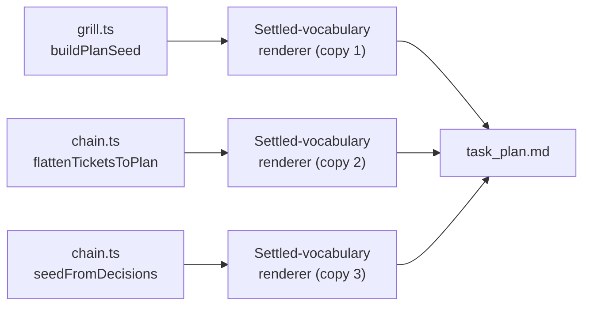
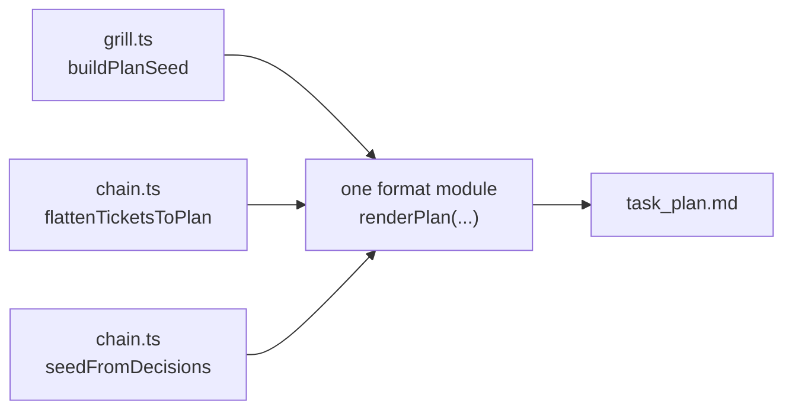
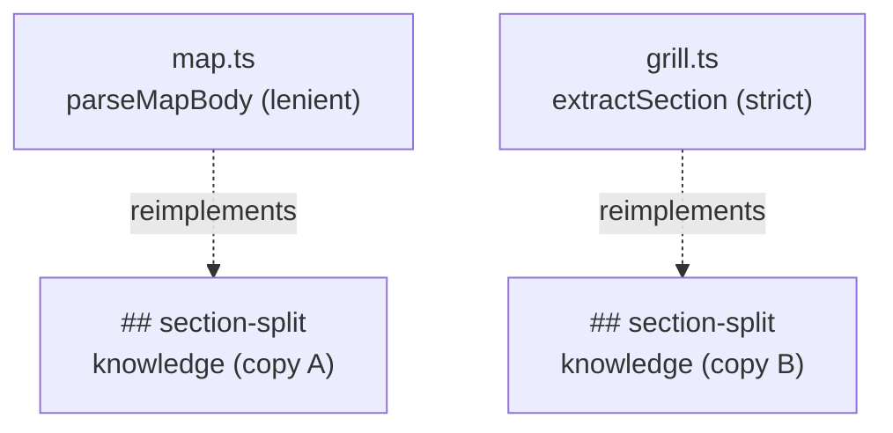
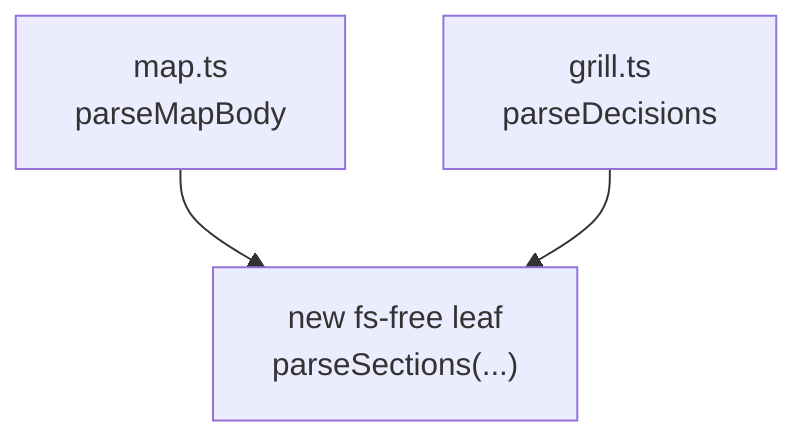
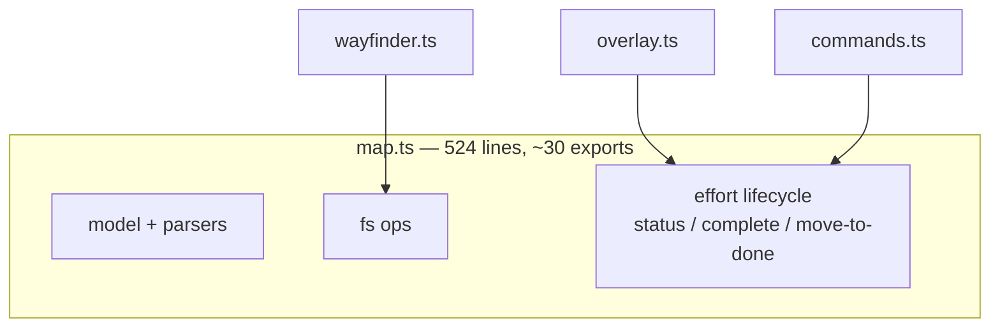
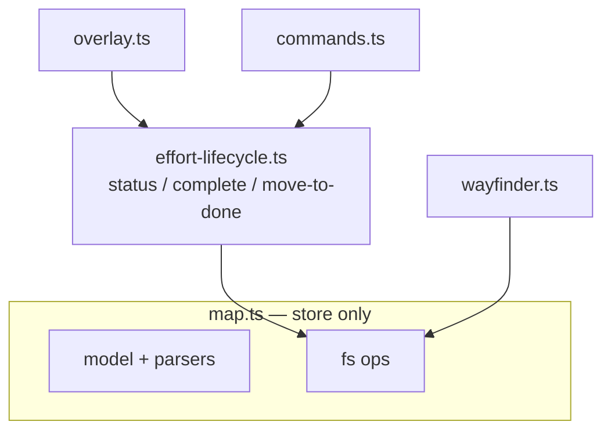

# Architecture review — pi-agent-ext-wayfind (dogfood)

**Scan base:** `HEAD` = `1e04b3ed` on branch `wayfind/improve-codebase-architecture` (working tree clean except the unstaged memory mod). **Target module cluster:** `bun-apps/pi-agent-ext-wayfind/src/` (15 modules, ~2,865 lines). **Scope chosen:** no direction named, so the scan weighted recent hot spots — `git log --oneline -- bun-apps/pi-agent-ext-wayfind/src/` — which cluster on `map.ts`, `chain.ts`, `commands.ts`, and the architecture converter (the deliverable C work). **Method:** the agent walked `src/` raw for friction (bouncing between small modules, shallow modules, pure functions split without locality, seams that leak, hard-to-test surfaces), then synthesized candidates in the shared `codebase-design` vocabulary with the deletion test.

**Domain context read first:** `CONTEXT.md` (grilling, wayfinder, map, decision ticket, frontier, grill→plan handoff, paper trail) and `docs/adr/0002`–`0006`. No candidate below contradicts an accepted ADR; ADR-0005 (last-write-wins for `.planning/`) is consistent with, not against, concentrating the write logic. No ADR is reopened.

Vocabulary used throughout: **module / interface / implementation / depth / deep / shallow / seam / adapter / leverage / locality**, plus the **deletion test**. Each candidate cites its friction + the `codebase-design` principle it invokes. Interfaces are NOT proposed here — that is the Grill step's job.

---

## Candidate 1: writing-plans format emitted three times — Strong

**Files**
`src/grill.ts` (`buildPlanSeed`), `src/chain.ts` (`flattenTicketsToPlan`, `seedFromDecisions`)

**Problem**
The writing-plans format — the `# Implementation Plan` header, the `**Goal:**` line, the `## Settled vocabulary` block (one `- **term**: definition` bullet per glossary term), and the `### Task N` scaffolding — is emitted by three separate functions across two modules. `buildPlanSeed`, `flattenTicketsToPlan`, and `seedFromDecisions` each rebuild that same scaffold with only the title suffix and the task body differing. The `## Settled vocabulary` renderer (`for (g of glossary) lines.push(\`- **${g.term}**: ${g.definition}\`)`) is copied verbatim in all three. Each function is **shallow**: its interface (a bag of inputs → one Markdown string) is nearly as complex as its implementation, because the implementation *is* the format, restated. Understanding "what shape is a seeded plan?" bounces across two modules and three functions — the small-module bounce the skill warns about.

**Friction + principle.** Bouncing-between-small-modules friction; format knowledge smeared where one deep module would hold it. Principle invoked: **depth** (one implementation behind one small interface) + **locality** (the format lives in one place). **Deletion test:** deleting the three emitters and routing through one format module *concentrates* the format into one place; the three call sites collapse to thin callers that supply only their task list. Complexity concentrates, it does not move. → genuine.

**Solution**
Make one deep module that owns the writing-plans format: it takes a goal, an optional glossary, and a list of task bodies, and emits the full Markdown. The three existing call sites (`/grill done --seed-plan`, `/wayfind seed` from tickets, `/wayfind seed` from decisions) become two- or three-line callers that hand it their task list and a title suffix. No interface is proposed here.

**Wins**
- locality: format lives in one module
- leverage: three callers, one emitter
- depth: format behind small interface
- change once, fixed everywhere

**Before**



**After**



---

## Candidate 2: two `## ` section parsers drift — Worth exploring

**Files**
`src/map.ts` (`parseMapBody`), `src/grill.ts` (`extractSection`)

**Problem**
Both modules parse `## Section`-delimited Markdown into section→text, but they do it differently. `parseMapBody` is lenient (it splits the heading on `(` / em-dash / colon so `## Resolution (closed …)` keys as "Resolution"); `extractSection` is strict (exact `## ` prefix match). `extractSection` exists in `grill.ts` at all only because `grill.ts` "deliberately does not import map.ts, which pulls node:fs" — a pure function was duplicated to dodge an import-graph concern, not for any cohesion reason. The two have *already diverged* (lenient vs strict) and will drift further. This is the "pure function extracted for testability without locality" smell: the shared knowledge (how a `## ` doc splits) is split across two modules with no shared leaf. Note this is drift, not the two-adapter case: nothing genuinely *varies* across a seam here demanding two adapters — it is one concern copied twice.

**Friction + principle.** Divergent duplicated parsing; a future heading-tolerance fix touches two places. Principle invoked: **locality** (one parser) + the rule that a module's seam should not force a second copy of its own knowledge. **Deletion test:** deleting `extractSection` and giving both call sites one fs-free section parser *concentrates* the parsing; the tolerance policy is decided once, not twice. → genuine, but small.

**Solution**
Extract a tiny leaf module with no `node:fs` import that parses a Markdown doc into its `## ` sections (carrying the lenient tolerance). `parseMapBody` builds on it; `grill.ts`'s `parseDecisions` builds on it. `grill.ts` stays fs-free — its stated goal — and the duplication vanishes.

**Wins**
- locality: one section parser, not two
- grill.ts stays fs-free
- tolerance decided once, not twice
- shallowness leaves both modules

**Before**



**After**



---

## Candidate 3: map.ts fuses store with lifecycle — Worth exploring

**Files**
`src/map.ts` (524 lines)

**Problem**
`map.ts` is the single home for four concerns: the data model (`Ticket`, `WayfindMap`, `EffortMeta`), the pure parsers (`parseMapBody`, `parseTicketFile`, `computeFrontier`), the fs ops (`readMap`, `writeMap`, `writeTicket`), AND the effort lifecycle (`setEffortStatus`, `completeEffort`, `readEffortMeta`, `doneDir`). Its own header comment promises "Pure parsers are split out from the fs ops … so the frontier logic is testable" — but the split is conceptual only; all four concerns share one module and one wide (~30-export) interface. The lifecycle half (the D1 "complete → stamp status → move to done/" ceremony, plus the cheap manifest read the overlay calls every render) is a distinct concern that grew into the file. The dependency runs one way only: lifecycle reads the store; the store never reads lifecycle. That one-way edge is exactly the shape of a clean internal seam waiting to be cut.

**Friction + principle.** A 524-line module with a wide interface; the lifecycle ceremony is hard to reason about in isolation because it is buried under the store. Principle invoked: **seam placement** (one module, one concern) + **depth** (each resulting module is deeper — the store's interface narrows to its real concern). **Deletion test:** deleting the lifecycle half into its own module *concentrates* the lifecycle knowledge and removes nothing the store's callers need. → genuine; the file is already deep, it is just fused.

**Solution**
Move the lifecycle functions (`setEffortStatus`, `completeEffort`, `doneDir`, `readEffortMeta`) into an `effort-lifecycle.ts` module that imports the store. `map.ts` keeps model + parsers + fs ops. `overlay.ts` and `commands.ts` import the lifecycle from its new home; `wayfinder.ts`'s `completeEffort` call moves with it. The store's interface narrows to its real concern.

**Wins**
- locality: lifecycle ceremony in one module
- map.ts interface narrows to store
- overlay reads manifest from lifecycle
- two deep modules, not one fused

**Before**



**After**



---

## Candidate 4: the effort-resolution ceremony repeats — Speculative

**Files**
`src/commands.ts` (`handleChainSync`, `handleWayfindDone`, `handleWayfindSeed`, `handleWayfindValidate`, `handleWayfinderStatus`)

**Problem**
Five handlers open with the same three-line ceremony: resolve the effort from `args.trim() || state.activeEffortBySession.get(sessionId)`, and if absent, `ctx.ui.notify("Usage: /wayfind <sub> <effort> …")` + `return`. Only the usage string differs. Each handler is shallow at the top — the "which effort, and is it missing?" knowledge is restated five times with no shared helper. A future change to the resolution rule (or the usage wording) lands in five places.

**Friction + principle.** The same resolution + usage block repeated five times. Principle invoked: **locality** (resolve once) + **leverage** (one helper, five call sites). **Deletion test:** deleting the five copies and routing through one resolver *concentrates* the resolution; each handler loses three lines and gains one. → genuine, but the win is modest.

**Solution**
A small helper that takes the args, the runtime state, and the session id, and returns the resolved effort (or signals "missing → notify usage"). The five handlers call it and bail when it signals missing. No interface proposed here.

**Wins**
- locality: effort resolution in one helper
- leverage: five handlers, one resolver
- usage wording lives in one place
- handlers shed three lines each

**Before**

```
handleSync      effort = args || active; if !effort notify(usage); …
handleDone      effort = args || active; if !effort notify(usage); …
handleSeed      effort = args || active; if !effort notify(usage); …
handleValidate  effort = args || active; if !effort notify(usage); …
handleStatus    effort = args || active; if !effort notify(usage); …
```

**After**

```
resolveEffort(args, state, sessionId) → effort | missing
        └── handlers: const e = resolveEffort(…); if (e.missing) return;
```

---

## Top recommendation

**Candidate 1** — make the writing-plans format one deep module. It is the only **Strong** candidate: the format is smeared across three shallow emitters in two modules, the deletion test *concentrates* (not moves) the complexity, and the leverage is immediate — every future change to the seeded-plan shape touches one module instead of three. Candidates 2 and 3 are clean follow-ups in the same direction (extract one shared leaf; split one fused module); Candidate 4 is a modest nice-to-have. None contradicts an accepted ADR.

**Which of these would you like to explore?**
