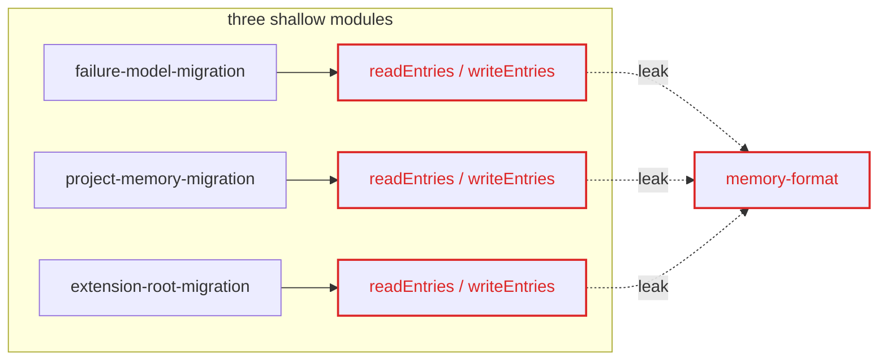
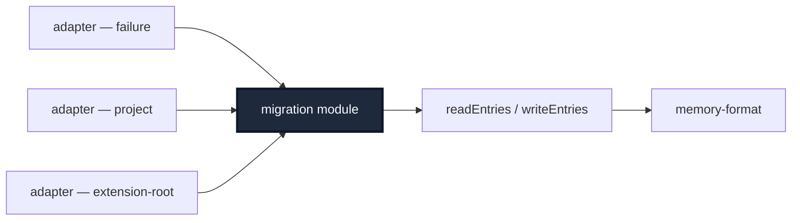

# Architecture review — pi-agent-ext-hermes-memory

## Candidate 1: Collapse the migration modules — Strong

**Files**
`src/failure-model-migration.ts`, `src/project-memory-migration.ts`, `src/extension-root-migration.ts`, `src/store/memory-format.ts`

**Problem**
Three migration modules each re-implement `readEntries`, `writeEntries`, and a result struct. The format seam leaks across all three; the interface of each nearly matches its implementation — shallow by duplication.

**Solution**
One deep migration module behind a single interface; each migration kind becomes an adapter over the shared read/write/collapse implementation.

**Before**



**After**



**Wins**

- locality: fs logic concentrates once
- interface shrinks; adapters absorb kinds
- leverage: one read/write path
- depth: collapse three shallow modules
- seam stops leaking format logic

**ADR**
If taken, record `CONTEXT.md` + ADR: "one migration module, kinds as adapters" — see `domain-modeling`.

## Candidate 2: Deepen staleness detection — Worth exploring

**Files**
`src/staleness.ts`

**Problem**
The staleness module exposes one predicate per entry kind. The interface surface is nearly as wide as the implementation — shallow by surface area, but the surface may be load-bearing.

**Solution**
One interface; entry-kind policy absorbed into the implementation. Worth exploring because the per-kind predicates may be genuine call-site demand, not accidental width.

**Before**

```
BEFORE — shallow (interface ≈ implementation)
+--------------+   +--------------+
|  interface   |   |              |
|  isStale     |   |              |
|  isResolved  |   | implementation|
|  isActive    |   | (timestamps  |
|  isCompressed|   |  + policy)   |
|  ...8 exports|   |  ~same mass  |
+--------------+   +--------------+
```

**After**

```
AFTER — deep (interface << implementation)
+------+         +--------------+
|iface |         |              |
|      |         |              |
|isStale|        | implementation|
|(1 fn) |        | (all policy) |
+------+         |              |
                 |              |
                 +--------------+
```

**Wins**

- interface narrows to one predicate
- implementation absorbs entry-kind policy
- leverage: one staleness seam
- depth grows; surface shrinks

## Top recommendation

Take **Candidate 1 — Collapse the migration modules**. The duplication is real (the failure-model source already comments "Mirrors project-memory-migration.ts"), the seam is provably leaking, and the deepening is mechanical: one module, three adapters. Candidate 2 is genuinely ambiguous and worth a grilling pass before any change.
