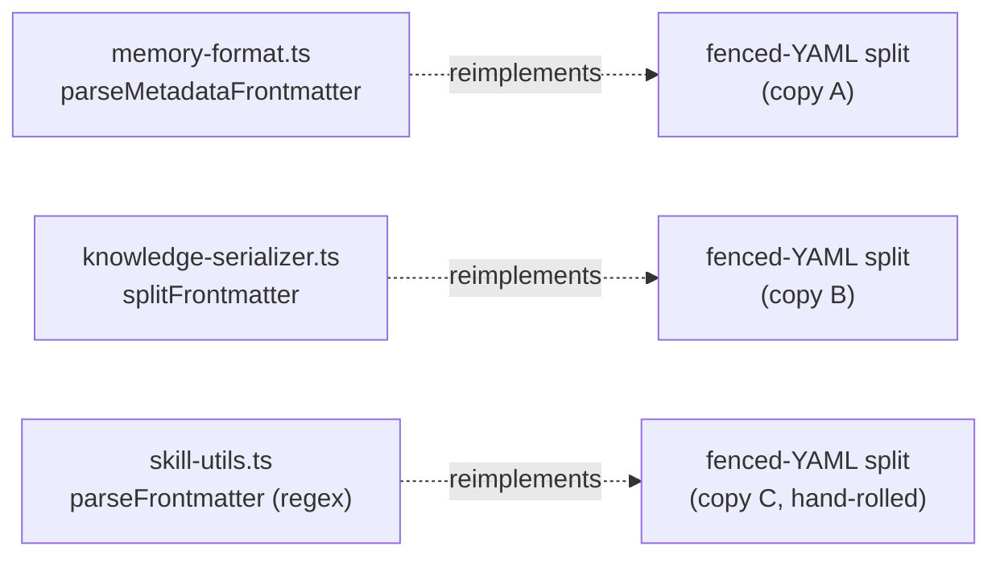
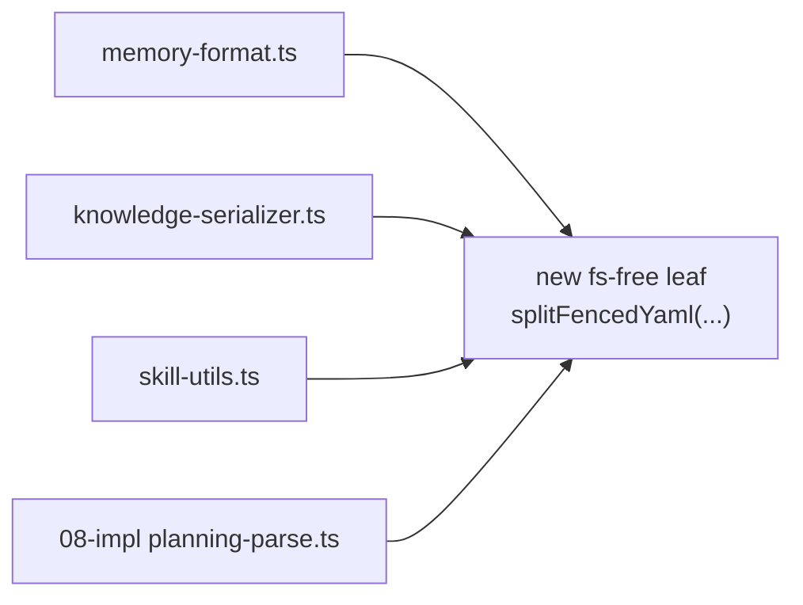
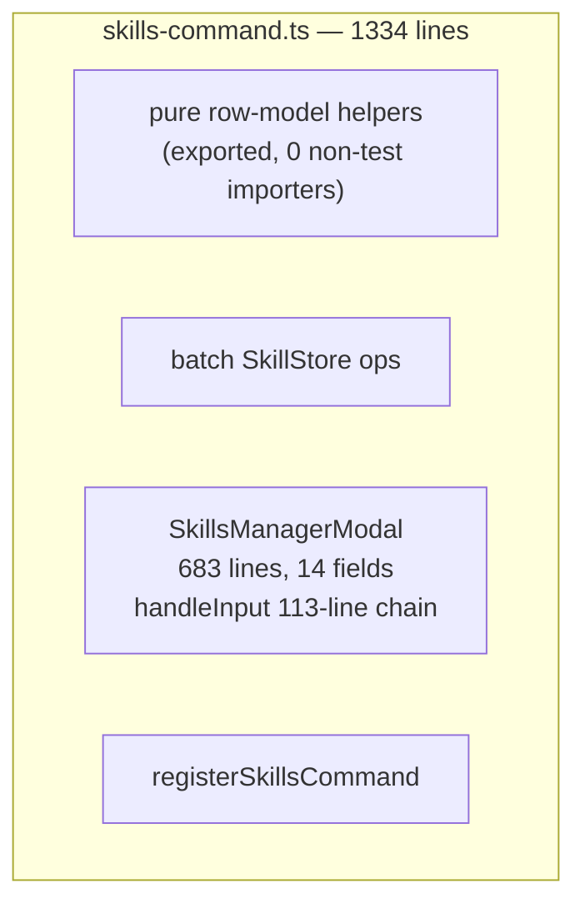
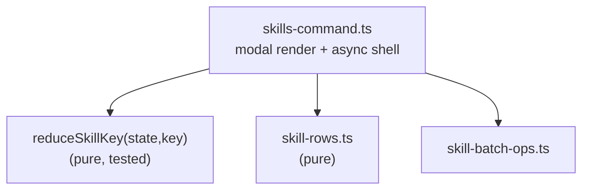
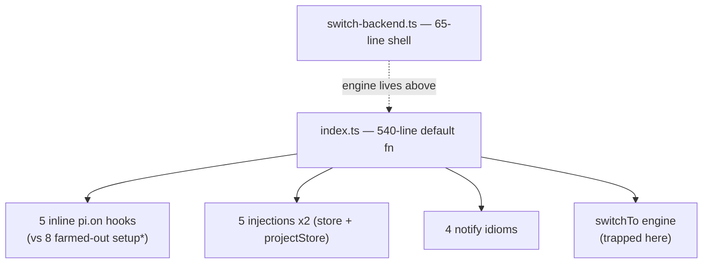
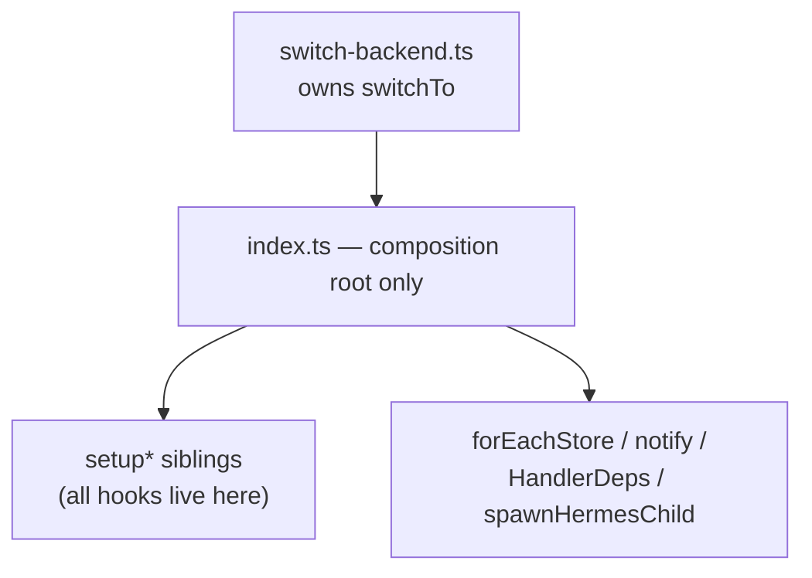
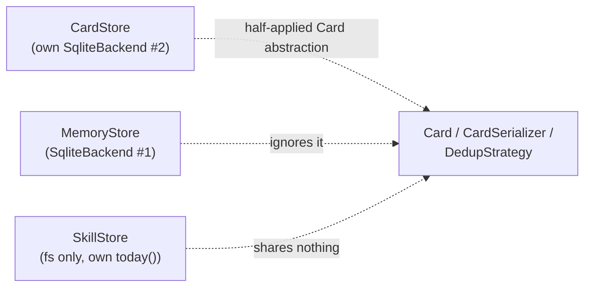
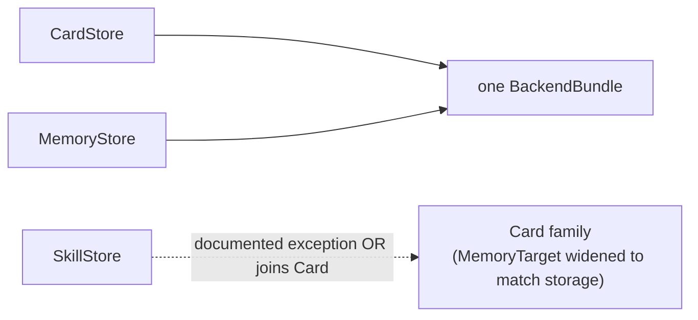

# Architecture review — pi-agent-ext-hermes-memory

**Scan base:** HEAD `e1aa0e33` on branch `feat/improve-codebase-arch`. **Target:** `bun-apps/pi-agent-ext-hermes-memory/src` (94 non-test files, ~21,728 LOC; tests 26,353 LOC, ratio 1.21). **Scope:** no direction named beyond "improve codebase architecture and simplify it"; weighted the package's hot spots — the store layer (`memory-store.ts` 1950, `sqlite-backend.ts` 1166, the sqlite/ vs surreal/ parallel repos), the surface layer (`skills-command.ts` 1334, `index.ts` 625), and the codec/card/knowledge families. **Method:** three parallel friction-walk subagents walked the clusters raw; the controller synthesized candidates in the shared `codebase-design` vocabulary with the deletion test.

**Domain context read first:** the package's `CONTEXT.md` (the five stores — Memory / User / Skills / Extended / Sessions; the backend-neutral `MemoryRepository` / `SessionRepository` seams; SurrealDB default-off; the learning loop; content scanning). No `docs/adr/` exists for this package — no candidate below contradicts a recorded decision.

Vocabulary: **module / interface / implementation / depth / deep / shallow / seam / adapter / leverage / locality** + the **deletion test**. Each candidate cites its friction + the principle it invokes. Interfaces are NOT proposed here — that is the Grill step's job.

> **Coordination note:** knowledge-pipeline Phase-2 (08-impl) is in-flight on this package, touching `card-store.ts`, `card.ts`, `sqlite/schema.ts`, `sqlite/sqlite-backend.ts`, `knowledge-walk.ts`, `walk-and-ingest.ts`. Candidates crossing these are flagged **IN-FLIGHT**.

---

## Candidate 1: four fenced-YAML + entry codecs drift apart — Strong  (TOP)

**Files** `store/memory-format.ts` (`parseMetadataFrontmatter`, `parseMarkdownMemoryEntry`), `store/knowledge-serializer.ts` (`splitFrontmatter`), `store/skill-utils.ts` (`parseFrontmatter`, `formatFrontmatter`, `today`), `store/memory-store.ts` (`decodeEntry`, `mdIdOf`), `store/memory-serializer.ts` (`MemorySerializer.deserialize`), `store/merge-plan.ts` (`parseEntry`).

**Problem** The "`---` fence split + YAML parse" concept is hand-rolled in **three** independent places — two scan `lines[]` for the closing fence then call `parseYaml`; `skill-utils` uses a regex plus a hand-rolled `key:value` line parser that understands only double-quoted scalars. Worse, the **memory-entry decode** (`detectEntryShape` -> parse -> field-by-field envelope reassembly) is reimplemented at **five** sites. `MemorySerializer`'s header calls itself "the single source of truth" — then its own comment admits "the store keeps calling `memory-format.ts` directly today (full rewire is 06b)." The extraction MOVED the codec without CONCENTRATING it. `mdIdOf` re-parses an entire frontmatter block just to read `.id`, at five call sites each sitting above where the entry was already decoded. The `raw.split(ENTRY_DELIMITER).map(trim).filter(Boolean)` idiom is copied verbatim at five more sites.

This is the **same drift** the skill's own prior dogfood found in `pi-agent-ext-wayfind` (Candidate 2, shipped as PR #1152) — and it is more advanced here.

**Friction + principle.** Pure functions extracted without locality; one concern (how a fenced card splits / how an entry decodes) smeared across five modules. Principles: **locality** (one codec) + **depth** (one implementation behind one small interface). **Deletion test:** routing every caller through one fence-split leaf + one entry codec CONCENTRATES the knowledge; `mdIdOf` deletes entirely once decode returns a value carrying `.id`. -> genuine.

**kp leverage:** 08 shipped on the old splitter; landing C1 now (before kp ticket 13's memory-card migration) prevents a 4th splitter and stops the §-entry codec drift from deepening — 13's round-trip acceptance depends on ONE codec.

**Solution** One fs-free leaf that splits a fenced YAML block (the lenient tolerance decided once), consumed by the memory / knowledge / skill codecs and the new planning codec. One entry-decode path that returns a value object carrying `.id`, replacing the five sites + `mdIdOf`. One `splitEntries(md)` helper. No interface proposed here.

**Wins**
- locality: one fence-split leaf, not four
- depth: one entry decode behind a value type
- mdIdOf deletes entirely
- 08-impl reuses the leaf (kp leverage)

**Before**


**After**


---

## Candidate 2: skills-command.ts fuses four concerns (1334 LOC) — Strong

**Files** `handlers/skills-command.ts` (1334): pure row-modeling helpers (`buildUnifiedSkillRows`, `buildSkillRows`, `filterSkillRows`, `matchesCategoryFilter`, `compareSkillRows`, `getSelectedSkillIds`, `formatSkillPath`, L87-393), batch `SkillStore` ops (`moveSelectedSkills`, `deleteSelectedSkills`, `confirmDeleteSelectedSkills`, L441-570), the 683-line stateful `SkillsManagerModal` class (L578-1260, ~14 mutable fields, 30+ private methods), and `registerSkillsCommand` (L1261).

**Problem** One file holds four concerns with no internal seam. The "exported" row-model helpers have **zero non-test importers** — a false seam (the `export` keywords move nothing). The 113-line `handleInput` key dispatcher (L993-1106) interleaves state transitions, async-action invocation, cursor math, and render side effects in one if/else chain over keymap x focusArea x modal sub-state — unreachable for testing except by driving a live TUI `Focusable`. The modal mixes a state machine with view rendering with no boundary between them.

**Friction + principle.** A 1334-line module with a wide interface; the input-reduction logic (where the real bugs hide) is untestable through the current surface. Principles: **locality** (one concern per module) + **depth** (a pure `reduceKey(state, key) -> state` behind the impure render). **Deletion test:** splitting row-model + batch-ops + a pure key-reducer into siblings CONCENTRATES each; the false `export`s delete. -> genuine.

**Solution** Sibling modules: a pure row-model module, a batch-ops module, and a pure `reduceSkillKey(state, key) -> state` the modal's `handleInput` delegates to (testable without a TUI). The modal keeps rendering + the async-action shell. No interface proposed.

**Wins**
- locality: row-model, batch-ops, key-logic each one module
- depth: pure key-reducer behind impure render
- handleInput becomes testable
- false exports delete

**Before**


**After**


---

## Candidate 3: sqlite-backend.ts fuses transport, corruption-recovery, migration — Worth exploring  IN-FLIGHT

**Files** `store/sqlite/sqlite-backend.ts` (1166), `store/sqlite/schema.ts` (158), `store/sqlite/sqlite-memory-repo.ts` (`mapRow`, L48-138).

**Problem** One class fuses three concerns: **transport** (the `DatabaseLike` / `StatementLike` / `BunDatabaseInstance` duck-typing, `runWithTransientRetry`, `isTransientDbError`), **file-level corruption recovery** (detect -> backup -> rebuild-from-readable-rows for five tables -> FTS rebuild -> swap, ~600 LOC), and **schema migration** (`ensureMemoriesColumns`'s 15+ column `if`-chain, `migrateMemoriesTarget*`). Schema evolution is an open-ended procedural append: the `memories` column list is declared in **three** places (`schema.ts`, `mapRow`, the migration's `memories_new` rebuild) that must agree or rows silently drop. The kp Phase-2 plan adds a **fourth** declaration (the planning migration) — the drift is actively growing.

**Friction + principle.** A reader chasing one bug bounces across transport, recovery, and migration in one 1166-line file; the column list is a keep-in-sync burden. Principles: **depth** (one coherent backend) + **locality** (corruption-recovery in its own module; one column-declaration source). **Deletion test:** splitting corruption-recovery out CONCENTRATES; a single column-declaration list read by schema + mapRow + migration removes the sync burden. -> genuine, but delicate (touches the in-flight migration code).

**Solution** A `corruption-recovery.ts` module owning the detect -> backup -> rebuild -> swap flow; the backend keeps transport + schema. One column-declaration constant read by `SCHEMA_SQL`, `mapRow`, and every migration rebuild. Coordinate with kp Phase-2's planning migration (let it read the shared list). No interface proposed.

**Wins**
- locality: corruption-recovery in one module
- depth: backend narrows to transport + schema
- one column list, three (soon four) readers
- kp migration reuses the shared list

**Before**
```
sqlite-backend.ts — 1166 lines
  [ transport: DatabaseLike/duck-types, runWithTransientRetry, isTransientDbError ]
  [ corruption-recovery: detect→backup→rebuild 5 tables→FTS→swap  (~600 LOC) ]
  [ schema-migration: ensureMemoriesColumns (15+ if), migrateMemoriesTarget* ]
schema.ts ......... memories columns  (declaration #1)
sqlite-memory-repo mapRow ............. memories columns  (declaration #2)
migration memories_new ................ memories columns  (declaration #3)
```

**After**
```
sqlite-backend.ts — transport + schema only
corruption-recovery.ts — detect→backup→rebuild→swap
memories-columns.ts — ONE column list
   ├─ schema.ts reads it        (declaration #1)
   ├─ mapRow reads it           (was #2)
   └─ every migration reads it  (was #3, + kp planning migration)
```

---

## Candidate 4: index.ts wiring — inline hooks, doubled injections, four notify idioms — Worth exploring

**Files** `src/index.ts` (540-line `default async function`), `handlers/switch-backend.ts` (65), the `setup*` / detector handlers, `tools/memory-tool.ts` (`registerMemoryTool`).

**Problem** The orchestrator owns config derivation, swappable-proxy setup, the live-switch engine, **five inline `pi.on` hooks** (session_start, before_agent_start, message_end, session_shutdown, resources_discover) alongside ~16 register calls — while eight *other* `pi.on` hooks are farmed out to `setup*` siblings. There is no consistent rule for what is inline vs encapsulated, so "where is session wiring?" bounces between the orchestrator and N handler files. Five provider injections are each written **twice** (once per store) differing only in `project: null` vs `projectName`. The same "best-effort UI notify" is expressed in **four** incompatible idioms (direct call, ad-hoc cast, optional-chain, hand-rolled `UiLike`). `switch-backend.ts` is a 65-line command shell while the real `switchTo` engine is trapped in `index.ts` — a shallow module whose engine is elsewhere. Four handlers independently restate the same six-tuple deps and independently derive the child-spawn env-flag contract.

**Friction + principle.** Ceremony repetition without adapters; a shallow module paired with a hidden engine. Principles: **leverage** (one adapter, many call sites) + **seam placement** (the named module should own its engine). **Deletion test:** `forEachStore` / `notify` / `HandlerDeps` / `spawnHermesChild` adapters + moving `switchTo` into `switch-backend.ts` + the inline hooks into `setup*` siblings CONCENTRATES the orchestrator into pure composition. -> genuine.

**Solution** A composition-root `index.ts` that only wires; the five inline hooks move to `setup*` siblings; small adapters for the doubled injection, the notify cast, the handler-deps tuple, and the child-spawn contract; `switchTo` moves to its named module. No interface proposed.

**Wins**
- locality: one notify, one deps bag, one child-spawn
- leverage: forEachStore — N sites, one rule
- switch-backend owns its engine
- index.ts narrows to composition

**Before**


**After**


---

## Candidate 5: the store trio — CardStore's own backend + half-applied Card abstraction — Strong (kp-13 prerequisite; promoted from defer 2026-08-12)

**Files** `store/card-store.ts` (`createCardStore`, `upsertCard`), `store/skill-store.ts` (828), `store/repository.ts` (`MemoryTarget`).

**Problem** Three "`*-store`" modules share a suffix and nothing else. `CardStore` advertises backend-neutrality but constructs its **own** `SqliteBackend` directly (bypassing `backend-factory` and the `Backend` / `BackendBundle` seam) — two independent SQLite connections to one `sessions.db`, with its own `close()`. Its `upsertCard` THROWS for every non-knowledge kind, so the "kind-agnostic Card / CardSerializer / DedupStrategy" unification is half-applied (memory kinds ignore it; `SkillStore` is a fourth unrelated codec with its own `today()`). Separately, the `MemoryTarget` TS union (`memory | user | failure`) is **narrower than storage** — the schema holds `knowledge` (and soon `planning-*`), so the interface silently under-describes the DB.

**Friction + principle.** An abstraction that claims generality it doesn't deliver; a concrete impl behind an interface claim; a type that drifts from storage. Principles: **seam** (one backend bundle) + **depth** (the interface describes what the DB holds). **Deletion test:** injecting one shared `BackendBundle` into all stores CONCENTRATES (deletes the second connection); widening `MemoryTarget` to match storage CONCENTRATES. -> genuine, but the Card abstraction is **mid-evolution under kp Phase-2** — deepening now collides with active work.

**Solution** **Promoted (2026-08-12):** 08/09 shipped; 10 pending. Do BEFORE kp ticket 13 — the memory-card migration needs the Card abstraction FINISHED (upsertCard no longer throws for non-knowledge kinds; one shared BackendBundle instead of CardStore's private SqliteBackend; MemoryTarget widened to match storage). No interface proposed.

**Wins**
- seam: one BackendBundle, one connection
- depth: MemoryTarget matches storage
- Card abstraction finishes or is honestly scoped
- (deferred — let kp land first)

**Before**


**After** (post-kp)


---

## Candidate 6: addMemory is a blind INSERT — dedup not in the MemoryRepository contract — Strong (kp-13 prerequisite)

**Files:** `store/sqlite/sqlite-memory-repo.ts`, `store/surreal/surreal-memory-repo.ts`, `store/repository.ts`, `tests/store/repository-contract.test.ts`.

**Problem:** `addMemory` computes no content-hash and performs no exact-duplicate check on either backend — identical content can double-persist via the DB write path. Dedup today covers only `syncMemoryEntry` (identity-dedup in `repository-contract.test.ts`); near-dup, topic-dup, and `addMemory` exact-dup are uncovered.

**Solution:** Promote an exact-dup check into the shared `MemoryRepository` contract (compute a content-hash at write time; skip/replace on match), and widen `repository-contract.test.ts` to cover near-dup, topic-dup, and `addMemory` exact-dup. Keeps the single-dedup-site goal (kp Decision 4) honest across BOTH the sync and add paths.

**Wins:** one dedup site, provable parity for kp ticket 13's acceptance ("dedup works against the unified store"); closes a real silent-double-persist bug.

**kp leverage:** kp ticket 13's acceptance criterion requires dedup parity against the unified store — without this, 13 inherits the blind-INSERT gap.

---

## Also surfaced (not candidates)

- **sqlite/ vs surreal/ parallel duplication** (`mapRow`, `buildScope`, the lexical -> graph search pipeline, the FTS ladder) — the deletion test CONCENTRATES (shared codec + query-adapter), but SurrealDB is **default-off** (`CONTEXT.md`); weighting where work actually happens, this is YAGNI unless Surreal activation is planned.
- **Zero direct tests in `src/store/sqlite/` and `src/store/surreal/`** — the impure orchestration (FTS-fallback ladders, graph-neighbor fetch, corruption-recovery row-copy, batched-sync transactions) where the real bugs live is exercised only indirectly. This is testing debt (the extracted-pure-fns-tested-but-wiring-not anti-pattern), not a deepening candidate; Candidates 2 and 3 both improve testability as a side effect.

---

## Top recommendation

**Re-sequenced 2026-08-12** against the knowledge-pipeline self-reflection (supersedes the earlier C1→C2 / defer-C5 ordering):

**Do BEFORE kp ticket 13 (memory-card migration) — the convergence prerequisites:**
- **C1 (codec unification)** — top pick. 08 shipped on the old splitter; landing C1 now removes the 4th splitter before 13's migration deepens the §-entry codec drift.
- **C5 (Card-abstraction finish)** — PROMOTED from defer. 13 needs the Card abstraction finished (no per-kind throws; shared backend; widened MemoryTarget).
- **C6 (NEW — dedup into the MemoryRepository contract)** — closes the blind-INSERT gap; 13's dedup-parity acceptance depends on it.

**Rolling / independent of 13:**
- **C2 (skills-command split)** — Strong, hot-spot, not in-flight; natural whenever capacity allows.
- **C3 (sqlite-backend split)** — IN-FLIGHT; coordinate with kp Phase-2's planning migration (column-declaration list at 3 sites, kp adds a 4th).
- **C4 (index.ts composition root)** — modest, high-leverage ceremony wins at the wiring hub.

Rationale: sequencing C1/C5/C6 before 13 keeps the memory-card migration mechanical + low-risk (as kp ticket 05 intends); deferring them makes 13 the integration flashpoint.
