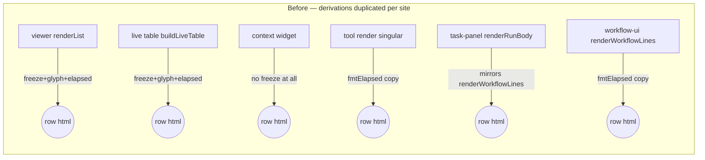
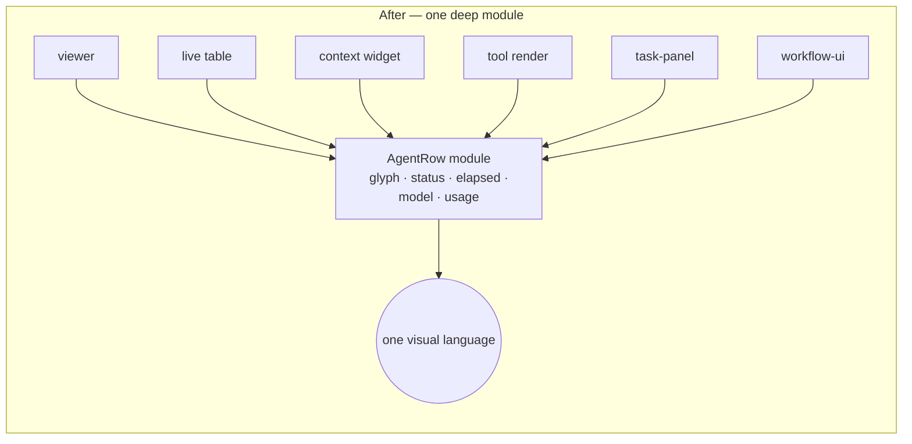
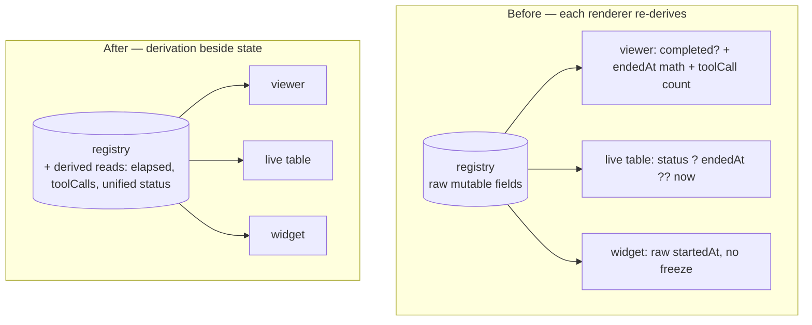

> STATUS: DONE — archived 2026-08-15 (shipped in main; see git history / PR references in map)
# Architecture review — subagent & workflow packages (2026-08-14)

**Scan base:** `origin/main @ b384c9ed` · **Method:** Wayfind `improve-codebase-architecture` — raw friction walks by two read-only subagents (subagent+core-runtime walk, workflow walk); vocabulary synthesis and ranking performed by the session lead, not delegated. Domain language from each package's `CONTEXT.md`; every `docs/adr/` decision is honored — no candidate below re-litigates ADR-0001…0004 (constraints are noted where they apply).

## Hot-spot evidence (why these two packages, why now)

- **subagent pkg:** ~15 of the last 25 commits touch the render/lifecycle chain (`subagents-tool.ts`, `subagent-viewer.ts`, render helpers) — not the runner. PR #1313 (elapsed freeze), #1289, #1101–#1110 all landed there.
- **workflow pkg:** the model-id/elapsed fixes (#840, #861, #863, #1076, #1199) each had to touch **multiple render surfaces** because agent-row rendering exists simultaneously in `display.ts`, `task-panel.ts`, `workflow-ui.ts`, and `subagent-viewer.ts`.
- Two structural re-slicing passes already landed (#1193 extract `workflow.ts`, #1251 extract `core-runtime`) — the packages are freshly cut. The friction that remains is in **state/presentation seams**, not package boundaries.

---

## C1 — AgentRow: one deep render module for the agent-row concept

**Strength: Strong**

**Files:** `pi-agent-ext-core-runtime/src/agent-row-display.ts` (the existing hub); `pi-agent-ext-subagent/src/subagent-tool-render.ts` (439 ln); `pi-agent-ext-subagent/src/subagents-tool.ts` render helpers (~640–860); `pi-agent-ext-subagent/src/subagent-viewer.ts`; `pi-agent-ext-workflow/src/task-panel.ts`; `pi-agent-ext-workflow/src/workflow-ui.ts` + `display.ts` (`renderWorkflowLines`).

**Problem:** One concept — the agent row (glyph + status + elapsed + model + usage) — is rendered at six-plus sites. The evidence is the bug history: PR #1313's elapsed-freeze bug existed because the freeze predicate was duplicated at three render sites and absent at a fourth (`subagent-context-widget.ts:172` still has no freeze check — same bug class survives there today). `fmtElapsed` exists in `agent-row-display.ts:69` yet eight hand-rolled `(ms/1000).toFixed(1)}s` copies persist (`subagent-tool-render.ts:122,258,407`; `subagents-tool.ts:662,797,854`; `subagent-viewer.ts:535,600`). Status-glyph mapping exists three times (`activityGlyph`, `followGlyph`, the inline `✓/⏱` in `buildLiveTable`). And singular vs batch maintain two parallel render stacks sharing concepts but no code.

**Solution:** Consolidate all agent-row rendering behind one deep module in core-runtime (grown from `agent-row-display.ts`): every call site hands it a run description and gets back a rendered row, badge, or header. The per-site derivations (freeze math, glyph choice, elapsed format, model segment, usage sum) are absorbed into the module and deleted from the call sites.

**Wins:**
- leverage: one interface, six render sites
- locality: elapsed bugs concentrate in one module
- interface shrinks; render sites delete derivations
- depth: complexity hidden behind row-in/line-out

**Before / After:**





---

## C2 — RunView: the registry owns derived run state and one status vocabulary

**Strength: Strong** (enabling seam for C1)

**Files:** `pi-agent-ext-core-runtime/src/subagent-in-flight.ts`; consumers `subagent-viewer.ts`, `subagent-context-widget.ts`, `subagents-tool.ts` (buildLiveTable), `agent-row-display.ts`.

**Problem:** The in-flight registry is a Map of mutable bags with render callbacks bolted on (`invalidate?`, `abort?` as public optional fields on a data interface, `in-flight.ts:83-87`). Every viewer re-derives presentation state from raw fields: `completed` checks, `endedAt ?? Date.now()` math, `history.filter(h => h.kind === "toolCall").length` counting duplicated across viewer (`:426`) and widget (`:168`). Two status vocabularies — registry `"running" | "completed"` vs run record `"done" | "failed" | …"` — are bridged ad hoc per site; `viewer.ts:413` even hardcodes `status: "running"` for a completed child. PR #1313 fixed the symptom (added `endedAt`) but the freeze *logic* still lives in every renderer instead of beside the state it derives from.

**Solution:** The registry exposes derived reads — final/live elapsed, tool-call count, a unified status vocabulary — computed next to the state they derive from. Renderers stop reading raw registry fields entirely and consume the derived view. (Plain-English only; no interface proposed here.)

**Wins:**
- locality: derivations live beside their state
- seam: renderers see values, not internals
- leverage: PR-#1313-class bugs structurally impossible
- interface narrows to reads

**Before / After:**



---

## C3 — Deepen the dispatch path: fold pass-through layers and shallow leaves

**Strength: Worth exploring**

**Files:** `pi-agent-ext-subagent/src/subagent-tool.ts` → `subagent-tool-schema.ts` → `subagent-tool-run.ts` → `spawn-subagent.ts` → core-runtime `agent.ts`; barrel `src/index.ts`; leaf modules `presets.ts` (64 ln), `impossible-tools.ts` (37 ln), `budget-defaults.ts` (84 ln), `time-format.ts` (19 ln).

**Problem:** Following ONE singular dispatch end-to-end opens **10 files across 2 packages** (entry → schema → run loop → spawn → runner → registry → inline render → viewer → widget → row glyphs). `SubagentToolOptions` (12 injectable fields) is threaded unchanged through three layers; `spawn-subagent.ts:211-214` re-spreads four of them verbatim. The barrel carries 60+ re-exported symbols and is load-bearing for the singleton module-identity contract (ADR-0001) — an accident-prone seam already re-touched by #1251/#1257. The four leaf modules each serve a single call site and fail the deletion test (deleting them just moves their one lookup table).

**Solution:** Merge the thin pass-through layers into fewer, deeper modules so one dispatch reads in 3–4 files; inline the single-call-site lookup tables; keep dependency-injection seams only where tests actually inject. Preserve the ADR-0001 `src/`-subpath singleton-identity rule exactly — the barrel's identity function must survive any fold.

**Wins:**
- locality: one dispatch, fewer files
- interface shrinks; layers absorb each other
- deletion test: shallow leaves fold inward

**Before / After:**

```
BEFORE (layered shallowness)          AFTER (deepened)
entry                                 entry+schema+run
 └ schema                              └ spawn (absorbs run loop)
    └ run loop                          └ runner (core-runtime)
       └ spawn                             └ registry
          └ runner
             └ registry
10 files / 2 packages                  ~5 files / 2 packages
options threaded 3 layers              options cross 1 seam
+ 4 single-caller leaf modules         leaves folded into their caller
```

**ADR constraint:** ADR-0001's module-identity decision and ADR-0002's viewer-relocation boundary stay in force; this candidate folds layers *inside* them.

---

## C4 — Workflow snapshot: engine-owned snapshot, panels render snapshot-in/string-out

**Strength: Worth exploring**

**Files:** `pi-agent-ext-workflow/src/workflow-manager.ts` (`createManaged` :435–456, `executeRun` :461–698, `updateInFlight` :714), `display.ts` (`createWorkflowSnapshot` :76), `workflow-ui.ts` (`persistedToSnapshot` :193), `task-panel.ts` (`renderPanel` :235, module-level `tokenSamples` :265).

**Problem:** `WorkflowSnapshot` is hand-built in **three places** (three copies of the same shape to keep in drift-lock). The manager's UI callback re-derives engine identity by reverse-linear scan (`[...managed.snapshot.agents].reverse().find(…)` :558, duplicated at :572) — engine-resume identity logic reimplemented in UI glue. A module-level mutable `tokenSamples` Map lives in a render file with its lifecycle owned by a TUI disposer (:447). And `renderPanel` requires a live `WorkflowManager` — there is no snapshot-in/string-out seam like `renderWorkflowLines` has, so panels are untestable without live runs.

**Solution:** One snapshot builder owned by the engine side; the panels take an immutable snapshot and return strings; derived token stats move into the snapshot. The reverse-scan identity derivation moves behind the seam it belongs to.

**Wins:**
- locality: one snapshot builder
- seam: UI renders values, not manager
- adapter: render testable without live runs

---

## C5 — Content out of the engine package

**Strength: Worth exploring**

**Files:** `pi-agent-ext-workflow/src/web-tools.ts` (125 ln), `deep-research.ts` (121 ln), `adversarial-review.ts` (111 ln), `workflow-editor.ts` (578 ln).

**Problem:** Workflow *template generators*, a Bing HTML scraper, and an interactive script editor (its own subsystem: RAINBOW, colorize, ANSI tokenizer) live inside the engine/infra package. Deletion test passes in reverse — deleting them removes zero engine capability; they are application content parked next to orchestration machinery, diluting the package's cohesion.

**Solution:** Move the generators and the editor to their own content/editor surface (package or workflow packs), leaving the engine package pure orchestration.

**Wins:**
- locality: engine package holds only engine
- leverage: engine package slims

---

## C6 — Shim sweep (quick win)

**Strength: Strong**

**Files:** `pi-agent-ext-workflow/src/display.ts` (:3–18 re-export block), `workflow-pack.ts` (`resolveWorkflowPack` :262 self-declared "thin projection"; deprecated `model` alias ~:420), `workflow.ts` (:8–11 legacy re-exports `hashAgentCall`/`parseWorkflowScript`/`createLimiter`), `pi-agent-ext-subagent/src/index.ts` (60+ symbol barrel, ~60 lines of re-export comments).

**Problem:** Pure pass-through shims kept so old import paths compile. Each is a module whose interface equals its implementation. The spawnSubagent back-compat re-export is already gone (#1251) — the remaining ones are unexamined residue.

**Solution:** One mechanical pass: delete the shims, update internal import paths. Keep only what ADR-0001 genuinely requires (the singleton-identity re-export path).

**Wins:**
- deletion test: zero behavior loss
- interface shrinks; wrappers vanish

---

## Top recommendation

**C2 first, C1 immediately after — as one effort.** C2 (RunView) is the enabling seam: unify the status vocabulary and move derived reads (frozen/live elapsed, tool-call counts) beside the state that produces them. C1 (AgentRow) then consumes that view and deletes the six-site derivation duplication. Together they make the PR-#1313 elapsed-freeze family — including the still-unfrozen `subagent-context-widget.ts:172` site — structurally impossible rather than patched, and the git evidence (~15/25 subagent commits and every workflow render fix touching multiple surfaces) says this is exactly where change cost concentrates. C6 can ride along in the same effort as a mechanical warm-up.
