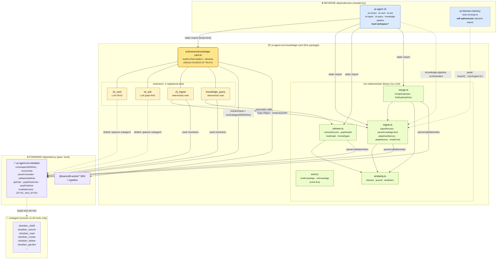
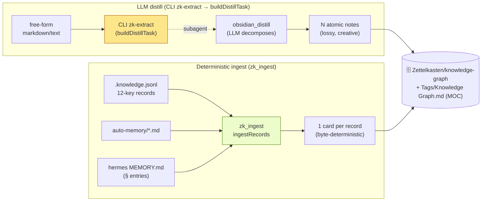
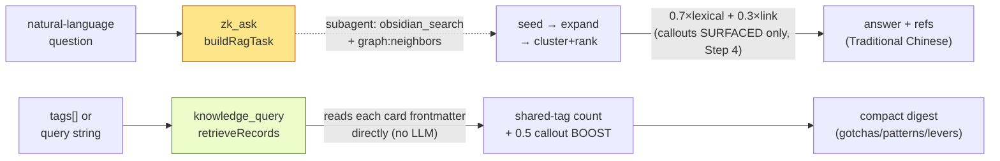
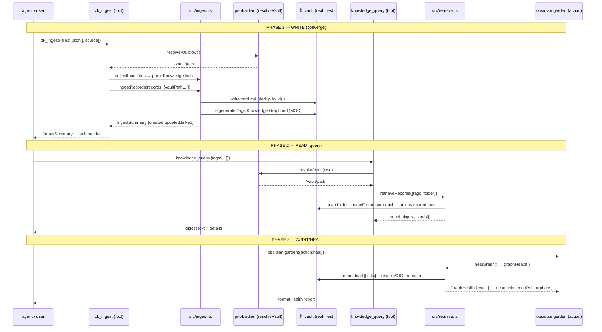

# pi-knowledge-card — Tool Orchestration & Dependency Map

> Snapshot: 2026-07-14. Grounded in `rg` import evidence across the repo (see
> "Evidence" at the bottom). Read alongside [`ARCHITECTURE.md`](./ARCHITECTURE.md)
> (module map) and [`DEPENDENCIES.md`](./DEPENDENCIES.md) (coupling strength).

## The 4 tools and what backs each

This extension registers **4 tools** across WRITE / READ / CRUD lanes.
(`zk_extract` was removed in #450 — pure passthrough to `obsidian_distill`, now used
directly; `graph_health` merged into `obsidian garden`.)

| Tool | Lane | Backed by | LLM? | Network? |
| ---- | ---- | --------- | :---: | :------: |
| `zk_ingest` | **WRITE** (deterministic) | `src/ingest.ts` (`ingestRecords`) | ❌ | ❌ |
| `zk_ask` | **READ** (graph-RAG) | isolated subagent → `obsidian_search`+`obsidian_read` | ✅ | ✅* |
| `knowledge_query` | **READ** (deterministic digest) | `src/retrieve.ts` (`retrieveRecords`) | ❌ | ❌ |
| `zk_card` | **CRUD** (all 5 actions) | isolated subagent → `obsidian_*` CRUD | ✅ | ✅* |

(Graph audit/heal — formerly `graph_health` — now lives in `obsidian garden`.)

\* LLM tools go to network **only if** the model endpoint is remote; a local
LM Studio server makes them network-free too. The 2 deterministic tools never
touch an LLM or the network regardless. (Was 3 before `graph_health` merged into
`obsidian garden`.)

## Visual diagram — full dependency + data-flow graph



## The two WRITE paths (convergence)



**Key invariant:** `zk_ingest` is the convergence sink. Both paths land cards in
the **same** folder (`Zettelkasten/knowledge-graph`) so cross-source `[[edges]]`
form by shared tags. The LLM-distill path (CLI `zk-extract` → `buildDistillTask` →
`obsidian_distill`) is for unstructured prose; `zk_ingest` is for structured records
(lossless + idempotent — re-ingest is a no-op).

## The two READ paths (by-design ranking split)



> **Why the split is correct** (pinned by `retrieve.test.ts` drift-guard):
> `retrieveRecords` reads each card's frontmatter at rank time, so it can apply
> the bounded callout boost. `zk_ask` ranks from `obsidian_search` results where
> frontmatter is NOT available until Step 4 (after ranking), so it can only
> surface callouts, not boost them. See [`ARCHITECTURE.md`](./ARCHITECTURE.md).

## Orchestration sequence — the deterministic chain (E2E-testable)

The 3 deterministic tools form a self-contained chain that needs **no LLM and
no subagent** — it is the part fully covered by the E2E test:



## Evidence (how every edge above was verified)

Every arrow in the diagrams is backed by a real import line in the repo:

<details>
<summary><b>Forward dep — imports FROM pi-obsidian (verified <code>rg</code>)</b></summary>

```
src/ingest.ts     → parseFrontmatter, validateZettelNote, ZETTEL_MAX_BYTES, VaultIndex
src/retrieve.ts   → parseFrontmatter, getIndex, graphDeadLinks, graphOrphans, invalidateCache
src/merge.ts      → parseFrontmatter
extensions/…      → runSubagentWithRetry, resolveVault
```
</details>

<details>
<summary><b>Reverse dep — pi-agent static imports (verified <code>rg</code>)</b></summary>

```
zk-ask.ts      ← buildRagTask, ragToolsFor, BlendMode          (extensions/…)
zk-card.ts     ← buildAdd/Find/Update/Remove + allowlists      (extensions/…)
zk-extract.ts  ← buildDistillTask + DISTILL_TOOLS              (extensions/…)
zk-ingest.ts   ← ingestRecords, parseKnowledgeJsonl, …         (src/ingest.ts)
zk-query.ts    ← retrieveRecords, graphHealth, mergeDuplicates (src/retrieve.ts + merge.ts)
knowledge-pipeline.ts ← ingestRecords, adaptHermesMarkdown, mergeDuplicates, graphHealth, healGraph
```
</details>

<details>
<summary><b>Reverse dep — pi-hermes-memory SOFT edge (verified)</b></summary>

```
src/store/vault-converge.ts:130   const kc = await import("@repo/pi-agent-ext-knowledge-card/src/ingest.ts");
  → wrapped in try/catch → returns {ok:false, unavailable:true} on failure (graceful)
package.json: peerDependencies.pi-knowledge-card: "*"
              peerDependenciesMeta.pi-knowledge-card: { optional: true }
              devDependencies.pi-knowledge-card: "workspace:*"
```
</details>

## What this means for changes

- **Renaming a tool** → only the `__setVaultResolverForTest` seam + allowlists
  tests + toolWiring break loudly (good).
- **Renaming an exported builder** (`buildRagTask` etc.) → pi-agent breaks at
  build time (caught by its 248-test suite).
- **Renaming a `src/` export** → pi-agent + pi-hermes-memory break; hermes
  degrades gracefully (try/catch), CLI fails loudly.
- **Changing pi-obsidian's parser contract** → ripples silently here UNLESS the
  ingest/retrieve tests catch it (they do — real temp vaults).

## Convergence gotchas (found via self-reflection on the pi-ext-dev extraction)

When ingesting a **cohesive batch** of records (e.g. the 11-card
`pi-ext-dev` fixture), the shared-tag cross-link algorithm
(`src/ingest.ts` step 3) has two behaviours worth knowing:

### 1. Batch crowding — low `maxLinks` fills the quota with intra-cluster edges

`ingestRecords` caps each card's `## 連結` neighbours at **`maxLinks` (default
8)**. A batch that shares a namespace tag (`pi-ext-dev`) across all records
produces strong intra-batch matches (shared = 2–3: the namespace tag + a
type/topic tag), which **fill the top-8 quota entirely** and crowd out the
weaker (shared = 1) edges to the existing graph. Measured on the pi-ext-dev
fixture against the 604-card production vault:

| `maxLinks` | intra-pi-ext-dev edges | edges → existing graph |
| ---------- | ---------------------- | --------------------- |
| 8 (default) | 84 | **0** |
| 20 | 110 | **110** |

**Fix for a cohesive extraction:** pass `maxLinks: 20` (or higher) so the
weaker-but-meaningful cross-source edges survive alongside the strong
intra-cluster ones. The static `## 連結` edges feed Obsidian's graph view and
zk_ask's `link_count` term; retrieveRecords re-ranks at query time anyway, so
extra edges do not hurt retrieval precision.

### 2. Generic-tag noise — type-tags crowd out specific bridges

Even with room for external edges, the shared-tag count treats **all tags
equally**. The auto-added record-type tag (`pattern`, 282 cards; `gotcha`, 135)
produces as many shared=1 matches as a specific bridge tag (`pi-obsidian`, 3
cards). With an alphabetical `localeCompare` tiebreak, the high-volume
type-tag matches dominate — so a pi-ext-dev card links to 10 unrelated
`auto-memory-anime2real-*` cards (shared: `pattern`) before it links to the 3
cards that share `pi-obsidian`.

This is a **known tradeoff of shared-tag ranking**, not a bug. An **IDF-weighting**
lever (kg-improvement-plan **P8**, shipped 2026-07-11 as opt-in
`linkWeighting:"idf"`) now lets rare tags (`pi-obsidian`) outrank ubiquitous
ones (`pattern`) via `Σ log(N/df)` over shared tags. It ships as a mechanism,
not the default: the lexical+graph ranking was MEASURED and pinned (iter-7),
so the default stays `"count"` until P8's promotion gate (beat count on
`real-retrieval-eval.json` hit-rate@4) is met. See
[`SAG-LEARNINGS.md`](./SAG-LEARNINGS.md) for the SAG study that motivated it.

> **Honest convergence metric:** after the `maxLinks=20` re-ingest, the pi-ext-dev
> cards carry 110 external edges, but most are weak (generic type-tag). The
> *meaningful* bridges (`pi-obsidian`, `schema-cost`, `testing`) exist in the
> pool but are alphabetically crowded. retrieveRecords' query-time ranking
> (which re-scores by the caller's tags, not the static links) is where precise
> relevance actually emerges.
