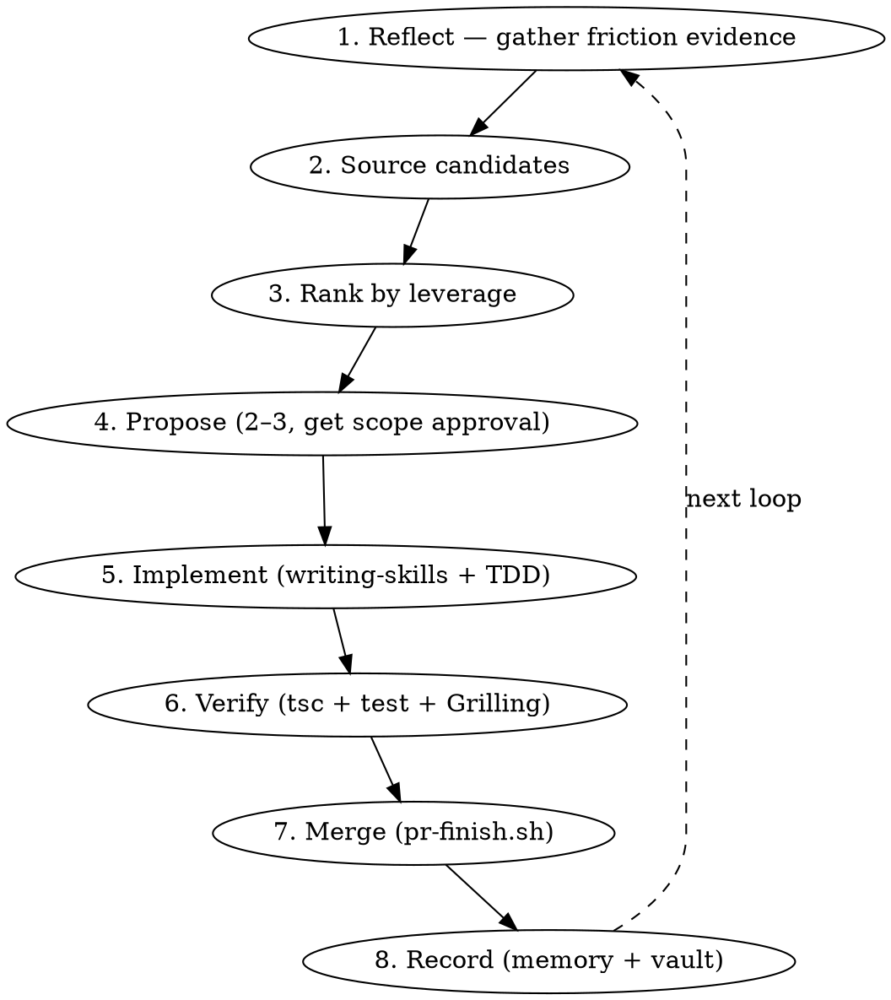

# Self-Improvement

## Overview

The skill suite improves **itself** by closing a loop: reflect on real friction → gather
evidence → rank candidates → propose → implement → verify → merge → record. This is the
meta-skill that orchestrates the others to evolve the suite. It is deliberately
**evidence-driven, not speculative** — every change must be backed by a real observed friction,
a real gap vs an upstream source, or a reactive→proactive opportunity.

**Core principle:** no skill is added or rewritten without an evidence-backed reason. YAGNI
applies hardest here — speculative skills are noise that dilute the suite and waste future
context.

**Announce:** "I'm using self-improvement to evolve this skill suite."

## When to use

- A project or iteration built with this methodology just completed (the friction is fresh).
- The user asks to "self-improve" / "improve the skills" / "make plan-with-files better".
- The **same** friction has recurred ≥2 times (a signal the suite doesn't cover it yet).
- Periodically, as a hygiene pass — but only if there's accumulated evidence to act on.

Do **not** use speculatively ("wouldn't it be nice if…"). If you cannot cite the friction, wait
until you can.

## The loop

### 1. Reflect — gather friction evidence

Don't brainstorm in a vacuum. Read the artifacts that recorded what was hard:

- the active/recent plan's **`findings.md`** + **`progress.md`** — retrospective items, W1/W2/W3
  notes, "what bit us" entries;
- the project's **failure / correction / insight memory** (recurrent mistakes, tool quirks);
- the suite's own skills — re-read; note any skill that **references a skill not bundled**
  (broken handoff), any weak/ambiguous section, any place a rule was routinely skirted.

If nothing recurred and nothing is broken, **stop** — there is no evidence-based improvement
to make this cycle.

### 2. Source candidates

Cross-reference the friction against where answers might already exist:

- the **upstream frameworks** the suite was adapted from (e.g. `superpowers-zh`, `matt_skills`)
  — does an upstream skill already address this friction?
- other skill collections; the project's own memory/vault.

### 3. Rank by leverage

Highest leverage first:

1. **Broken handoff** — a skill references one that isn't bundled. (Highest: the suite lies
   about its own structure.)
2. **Recurring friction (≥2×)** with no covering skill.
3. **Strong skill, reactive-only gap** → make it proactive (e.g. a "remember to verify" rule
   gains an adversarial self-interrogation step).
4. **Refresh** where upstream genuinely drifted (low — only if content actually changed; a
   faithful adaptation is not stale just because upstream moved).

### 4. Propose

Present 2–3 ranked candidates with tradeoffs and a recommendation (use `brainstorming` +
`ask_user_question`). Get the user to pick the **scope** before implementing — never silently
expand scope mid-implementation.

### 5. Implement

- Author/refresh following the **`writing-skills`** CSO rules (trigger-only description,
  hyphen-name, ≤1024-char frontmatter, etc.).
- **Port Pi-native, never copy verbatim**: map framework-specific concepts to pi's tools
  (`subagent`/`workflow`/`todo`/`ask_user_question`) and to **this repo's** conventions
  (sibling worktrees, `pr-finish.sh`, `stale-branches.sh`, the `no-cd-drift` hook). A copied
  skill that names another harness's tools is worse than no skill.
- **TDD**: `tests/skills.test.ts` is the red→green gate — write the skill, then watch its 8 CSO
  assertions pass. Update the expected-skill set in the test when the suite grows.

### 6. Verify

`bun run build` (tsc) + `bun run test` (full suite). Then run the **Grilling** from
`verification-before-completion` before claiming done — especially "what evidence backs that
this improvement was needed, and what proves it works now?"

### 7. Merge

Workspace via `using-git-worktrees`; close out via `finishing-a-development-branch`
(`./scripts/pr-finish.sh <PR#>`). **One improvement focus per PR** — reviewable, and the
dogfood run validates the merge helper itself.

### 8. Record

Write what changed, the evidence that justified it, and the transferable pattern to memory
(global `insight`) and/or the vault (`zk_ingest`). This is what gives the **next** loop more
signal — step 1 of the next cycle reads what step 8 of this one wrote.

## Candidate sources (concrete)

For this bundle, the proven sources are: `superpowers-zh/skills/*`, `matt_skills/skills/*`,
the project's `failure`/`correction`/`insight` memory, and friction notes in `.planning/*/findings.md`
+ `progress.md`. Re-reading the upstream is what turned "the suite is fine" into three real gaps
+ a rigor technique in a prior cycle.

## Red lines

Never:
- add or rewrite a skill without an evidence-backed reason (YAGNI);
- copy a framework skill verbatim — always port Pi-native;
- skip the `writing-skills` CSO rules (the test enforces them regardless);
- skip verification (tsc + test + Grilling);
- bundle unrelated improvements into one PR;
- delete or rename a skill without checking its inbound cross-references;
- declare the suite "improved" without showing the before/after evidence.

Always:
- cite the friction (a memory entry, a findings note, a broken reference) before proposing;
- get scope approval before implementing;
- keep one writer per worktree; end with `stale-branches.sh` (expect 0 stale);
- record the change so the next loop has more signal.

## Integration

This is the **meta-skill** that orchestrates the suite's evolution. It calls:
- `brainstorming` — to propose candidates;
- `writing-skills` — to author/refresh correctly;
- `test-driven-development` — the CSO test is the red→green gate;
- `using-git-worktrees` — workspace;
- `verification-before-completion` (+ Grilling) — the done-gate;
- `finishing-a-development-branch` — merge.

Together with `writing-skills` (which governs *authoring* a single skill), this skill governs
*which* skills to evolve and *how* to run the loop — closing the self-improvement recursion.
