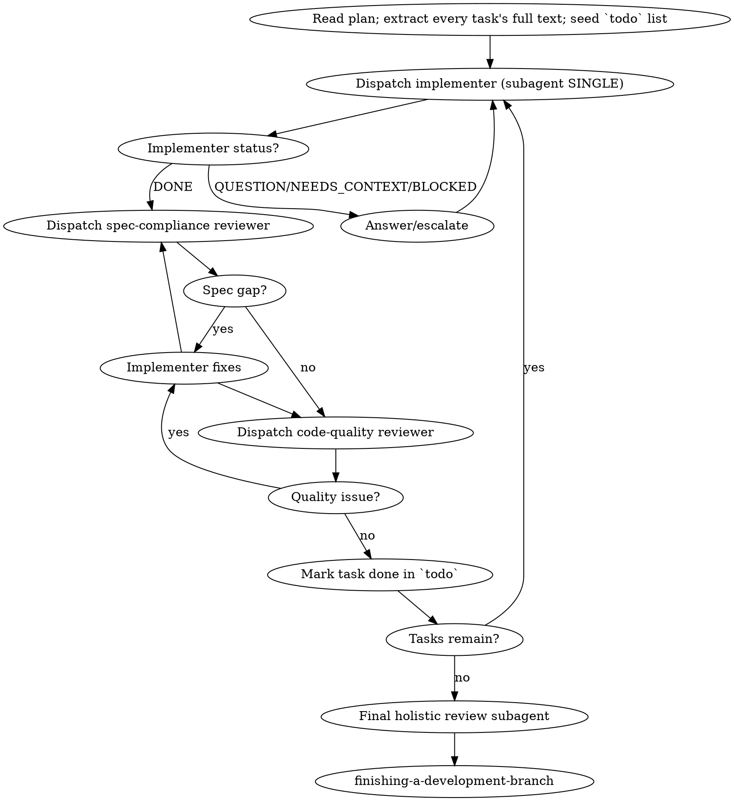

# Subagent-Driven Development

## Overview

Execute an implementation plan by dispatching a **fresh, context-isolated subagent per task**,
then reviewing each result in two phases: first spec compliance, then code quality. The
orchestrator (you) stays clean and coordinates; the subagents do the focused work.

**Core principle:** one fresh subagent per task + two-phase review (spec, then quality) =
high quality, fast iteration, no context pollution.

**Why subagents:** each task runs in an isolated context that you deliberately construct. You
pass the full task text + needed context — the subagent does not inherit your session history.
This keeps your own context free for orchestration and prevents earlier-task detail from
bleeding into later tasks.

## When to use

- You have a written implementation plan (from `writing-plans`) with discrete tasks.
- The tasks are **largely independent** (each produces a self-contained change).
- You want to stay in the current session (no context switching).

If tasks are tightly coupled (later tasks rewrite earlier ones), execute inline with
`executing-plans` instead. If you want deterministic multi-agent orchestration with
fan-out/pipeline, use the `workflow` tool.

**Announce:** "I'm using subagent-driven-development to execute this plan."

## Process

1. **Seed the plan.** Read the plan file once; extract the full text of every task (files,
   tests, steps) into notes; create a `todo` entry per task. Do **not** make subagents read
   the plan — hand them the complete task text.
2. **Per task — dispatch an implementer** (`subagent` SINGLE, or `workflow` agent() for a
   scripted fan-out). Pass: the full task text, the relevant file paths, the test command,
   and the convention that the implementer must follow `test-driven-development` (red→green).
3. **Handle implementer status:**
   - **DONE** → proceed to spec review.
   - **DONE_WITH_CONCERNS** → read the concerns; if correctness/scope, resolve before review;
     if observational, note and proceed.
   - **NEEDS_CONTEXT / QUESTION** → answer fully, re-dispatch with the added context.
   - **BLOCKED** → never silently retry unchanged. Either supply context, upgrade the model,
     split the task, or escalate to the human. *Ignoring an escalation is a red line.*
4. **Spec-compliance review** — dispatch a reviewer subagent that checks the diff **only**
   against the task spec: every requirement met, nothing extra built. Red line: do not start
   the code-quality review until spec compliance passes.
5. **Code-quality review** — dispatch a reviewer subagent that checks the diff for quality
   (naming, structure, magic numbers, test design). Loop fixes→re-review until clean.
6. **Mark the task done** in `todo`; advance to the next task. Never carry an open review
   issue into the next task.
7. **Final holistic review** — one subagent reviews the whole branch for coherence, then hand
   off to `finishing-a-development-branch`.

## Model selection

Use the cheapest model that can do each role — pass it via the `model` field on `subagent`.

- **Mechanical tasks** (isolated function, clear spec, 1–2 files): fast/cheap model. A
  well-written plan makes most tasks mechanical.
- **Integration / judgment** (multi-file, pattern-matching, debugging): standard model.
- **Architecture / design / review**: strongest available model.

This repo's defaults: primary = LM Studio `google/gemma-4-26b-a4b-qat`; fallback =
`deepseek-v4-flash` (only for structured-output recovery or poor tool adherence).

## Dispatch shapes (pi-native)

- **`subagent` SINGLE** — one implementer or one reviewer. The default per-task shape.
- **`subagent` PARALLEL** — independent tasks with no shared files; set `concurrency` to bound
  it. Never parallelize implementers that touch the same files (they conflict).
- **`subagent` CHAIN** — sequential tasks where each consumes the previous output.
- **`workflow`** — deterministic JS orchestration (`agent()`, `parallel()`, `pipeline()`) when
  you want repeatable fan-out with a fixed script rather than ad-hoc dispatch.

## Worktree discipline

Run all of this inside a dedicated worktree (see `using-git-worktrees`). Never begin
implementation on `main`. The orchestrator owns the single writer per worktree — do not let
parallel implementers write to the same tree.

## Red lines

Never:
- start implementation on `main`/`master` without explicit consent;
- skip either review (spec compliance **or** code quality);
- start the code-quality review before spec compliance passes;
- carry an unresolved review issue into the next task;
- dispatch parallel implementers that touch the same files;
- let the implementer read the plan file — pass the full task text instead;
- accept "close enough" on spec compliance;
- treat the implementer's self-review as a substitute for the formal reviews;
- ignore a BLOCKED escalation or retry the same model unchanged;
- trust a subagent's "success" report — inspect the diff (`verification-before-completion`).

Always:
- answer subagent questions fully before letting it proceed;
- after a reviewer finds an issue: implementer fixes → reviewer re-reviews → repeat until clean.

## Integration

- **Requires:** `writing-plans` (creates the plan this skill executes).
- **Requires first:** `using-git-worktrees` (isolated workspace).
- **Subagents must use:** `test-driven-development`.
- **Cross-cutting:** `verification-before-completion` governs every "done" claim and every
  acceptance of a subagent's report.
- **Ends with:** `finishing-a-development-branch`.
- **Alternative:** `executing-plans` for inline (non-subagent) execution.
