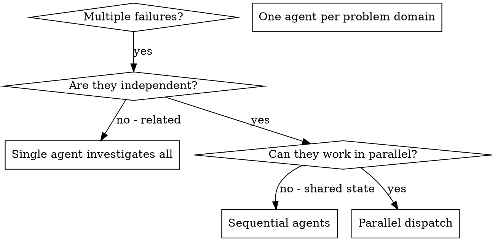

# Dispatching Parallel Agents

## Overview

You delegate tasks to specialized agents with isolated context. By precisely crafting their instructions and context, you ensure they stay focused and succeed at their task. They should never inherit your session's context or history — you construct exactly what they need. This also preserves your own context for coordination work.

When you have multiple unrelated failures (different test files, different subsystems, different bugs), investigating them sequentially wastes time. Each investigation is independent and can happen in parallel.

**Core principle:** Dispatch one agent per independent problem domain. Let them work concurrently.

## When to Use



**Use when:**
- 3+ test files failing with different root causes
- Multiple subsystems broken independently
- Each problem can be understood without context from others
- No shared state between investigations

**Don't use when:**
- Failures are related (fix one might fix others)
- Need to understand full system state
- Agents would interfere with each other

## The Pattern

### 1. Identify Independent Domains

Group failures by what's broken:
- File A tests: Tool approval flow
- File B tests: Batch completion behavior
- File C tests: Abort functionality

Each domain is independent - fixing tool approval doesn't affect abort tests.

### 2. Create Focused Agent Tasks

Each agent gets:
- **Specific scope:** One test file or subsystem
- **Clear goal:** Make these tests pass
- **Constraints:** Don't change other code
- **Expected output:** Summary of what you found and fixed

### 3. Dispatch in Parallel

Issue all three subagent dispatches in the same response — they run in parallel:

```text
Subagent (general-purpose): "Fix agent-tool-abort.test.ts failures"
Subagent (general-purpose): "Fix batch-completion-behavior.test.ts failures"
Subagent (general-purpose): "Fix tool-approval-race-conditions.test.ts failures"
# All three run concurrently.
```

Multiple dispatch calls in one response = parallel execution. One per response = sequential.

### 4. Review and Integrate

When agents return:
- Read each summary
- Verify fixes don't conflict
- Run full test suite
- Integrate all changes

## Agent Prompt Structure

Good agent prompts are:
1. **Focused** - One clear problem domain
2. **Self-contained** - All context needed to understand the problem
3. **Specific about output** - What should the agent return?

```markdown
Fix the 3 failing tests in src/agents/agent-tool-abort.test.ts:

1. "should abort tool with partial output capture" - expects 'interrupted at' in message
2. "should handle mixed completed and aborted tools" - fast tool aborted instead of completed
3. "should properly track pendingToolCount" - expects 3 results but gets 0

These are timing/race condition issues. Your task:

1. Read the test file and understand what each test verifies
2. Identify root cause - timing issues or actual bugs?
3. Fix by:
   - Replacing arbitrary timeouts with event-based waiting
   - Fixing bugs in abort implementation if found
   - Adjusting test expectations if testing changed behavior

Do NOT just increase timeouts - find the real issue.

Return: Summary of what you found and what you fixed.
```

## Common Mistakes

**❌ Too broad:** "Fix all the tests" - agent gets lost
**✅ Specific:** "Fix agent-tool-abort.test.ts" - focused scope

**❌ No context:** "Fix the race condition" - agent doesn't know where
**✅ Context:** Paste the error messages and test names

**❌ No constraints:** Agent might refactor everything
**✅ Constraints:** "Do NOT change production code" or "Fix tests only"

**❌ Vague output:** "Fix it" - you don't know what changed
**✅ Specific:** "Return summary of root cause and changes"

## When NOT to Use

**Related failures:** Fixing one might fix others - investigate together first
**Need full context:** Understanding requires seeing entire system
**Exploratory debugging:** You don't know what's broken yet
**Shared state:** Agents would interfere (editing same files, using same resources)

## Real Example from Session

**Scenario:** 6 test failures across 3 files after major refactoring

**Failures:**
- agent-tool-abort.test.ts: 3 failures (timing issues)
- batch-completion-behavior.test.ts: 2 failures (tools not executing)
- tool-approval-race-conditions.test.ts: 1 failure (execution count = 0)

**Decision:** Independent domains - abort logic separate from batch completion separate from race conditions

**Dispatch:**
```
Agent 1 → Fix agent-tool-abort.test.ts
Agent 2 → Fix batch-completion-behavior.test.ts
Agent 3 → Fix tool-approval-race-conditions.test.ts
```

**Results:**
- Agent 1: Replaced timeouts with event-based waiting
- Agent 2: Fixed event structure bug (threadId in wrong place)
- Agent 3: Added wait for async tool execution to complete

**Integration:** All fixes independent, no conflicts, full suite green

## Verification

After agents return:
1. **Review each summary** - Understand what changed
2. **Check for conflicts** - Did agents edit same code?
3. **Run full suite** - Verify all fixes work together
4. **Spot check** - Agents can make systematic errors

## Pre-dispatch guardrails (run before EVERY dispatch)

Subagent dispatch is the largest source of token waste in this stack. Run-history
analysis (2026-08-09, ~30 subagent runs): **budget exhaustion is the dominant
failure** — 15 of ~30 runs; per-run usage 130k–3.4M tokens. A "write 2 memory
entries" task cost **927k tokens** because the subagent lacked the `memory` tool
and reverse-engineered a workaround instead of failing fast.

1. **Budget — always set it.** Pass `tokenBudget` + `spendBudget`, calibrated:
   read-only research/inventory → 30k–60k; single SDD implementer slice →
   80k–150k; big synthesis/multi-file → 150k–300k. Raise above these only with a
   stated reason — the uncapped default is the bug, not the baseline.
2. **Scope — always set `commitScope`.** Exact paths the subagent may touch;
   `[]` for read-only. State the same exact paths in the task prose. Never ask a
   subagent to `git add` selectively on its own.
3. **Tool-fit — never delegate an impossible task.** Confirm every tool the task
   needs is in the subagent's allowlist; otherwise do it in the orchestrator,
   add the tool, or reshape the task.
4. **Bound the task.** If it would plausibly exceed the tier budget, split into
   staged dispatches. One subagent = one bounded outcome.
5. **Pick the right tool.** read-only parallel fan-out → `subagents` (plural);
   one focused task with side effects → `subagent` (singular); a trivial single
   write/call → do it in the orchestrator.
6. **Tag the tier.** small (search/inventory) · medium (balanced) · big
   (synthesis/judgment).

### Anti-patterns

- Dispatching with no `tokenBudget`.
- `git add -A` / `git add .` inside a subagent.
- Delegating a task that needs a tool the child lacks.
- Re-verifying from a detached HEAD, or redundant confirmation loops.
- One giant task where bounded dispatches would do.

### Knob locations

- `tokenBudget` / `spendBudget` params — `bun-apps/pi-agent-ext-subagent/src/subagent-tool.ts`
- `commitScope` guard — `bun-apps/pi-agent-ext-subagent/src/git-scope.ts`
- `DEFAULT_TIMEOUT_MS` (15 min) — `bun-apps/pi-agent-ext-subagent/src/subagent-tool.ts`

## Research as a background subagent (markdown-findings artifact)

When a question needs investigating against high-trust primary sources, dispatch
a **background subagent** (apply the guardrails above) and keep working while it
reads. Give it the question, the output path, and the citation rule:

1. Investigate against **primary sources** — official docs, source code, specs,
   first-party APIs, the code under your feet. A blog paraphrasing the docs is a
   lead, not a citation; the docs are the citation.
2. Write the findings to a **single Markdown file, citing each claim's source** —
   a link, a `file:line`, a commit, an API response. An uncited claim is a hunch;
   either find its source or mark it explicitly as the agent's inference.
3. Save it where the repo already keeps such notes; if there is none, put it
   under `.planning/<effort>/` (a `findings.md` or a `research/` note next to the
   decision it informs) and say where.

Research gathers *facts*; if the question is a *decision*, take what it found
into the decision process and resolve it there — don't let the research subagent
decide.
