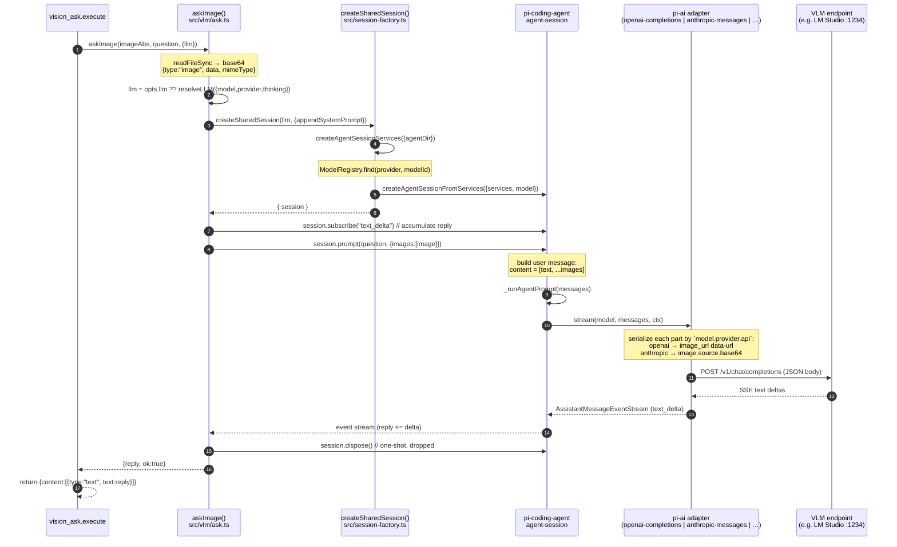

# `vision_ask` architecture — call chain & image transport

This document traces a single `vision_ask(image, question)` invocation from the
tool boundary down to the bytes that leave the machine, with citations into the
installed source. It answers two questions:

1. **Model selection** — how is the VLM target decided? (`resolveLLM`)
2. **Image transport** — how does one image become a provider-specific request?
   (`session.prompt` → core loop → pi-ai adapter)

## 1. The full call chain

### Sequence diagram



### Layer-by-layer

| # | Layer | File | What happens |
|---|---|---|---|
| 1 | Tool boundary | `extensions/file2md.ts:212` | `vision_ask.execute()` resolves the image path to absolute and calls `askImage()`. |
| 2 | Primitive | `src/vlm/ask.ts` → `askImage()` | Reads the file to base64, builds the neutral image part `{type:"image", data, mimeType}` (mime guessed from extension). |
| 3 | Model resolve | `src/sessions.ts` → `resolveLLM()` | Pure parser: turns `{model,provider,thinking}` + env into `{provider, modelId, thinkingLevel}`. **No I/O.** |
| 4 | Session factory | `src/session-factory.ts` → `createSharedSession()` | Builds `AgentSessionServices` (resolves `~/.pi/agent/models.json` via `getAgentDir()`), looks the model up in `ModelRegistry`, returns a real s2-agent session. |
| 5 | Pi-agent session | `@earendil-works/pi-coding-agent` `dist/core/agent-session.js` `prompt()` (`:873`) | Wraps `question` + `images` into a `user` message (`content = [{type:"text"}, ...images]` at `:873-875`), runs the agent loop. |
| 6 | Adapter dispatch | `@earendil-works/pi-ai` `dist/api/*.js` | The provider's `api` field (from models.json) selects the adapter that serializes the message to wire JSON. |
| 7 | Network | (inside the adapter) | `client.chat.completions.create(...)` / Anthropic SDK `/messages`. This is the **only** outbound HTTP in the whole chain. |
| 8 | Stream back | `ask.ts` `session.subscribe` | Accumulates `text_delta` events into `reply`; trims; returns. |

> The session created at step 4 is **one-shot**: `ask.ts` calls `session.dispose()`
> in a `finally`. There is no tool loop, no skill/template expansion relevant
> here (those run inside `prompt()` only if the text starts with `/`, which a
> vision question never does).

## 2. Model selection — `resolveLLM`

Source: `src/sessions.ts`. Pure parser, pinned by `__tests__/sessions.test.ts`.

### Precedence (highest → lowest)

| Rank | Source | Field |
|---|---|---|
| 1 | tool params | `params.model` / `params.provider` / `params.thinking` |
| 2 | env | `PI_MODEL` / `PI_PROVIDER` / `PI_THINKING` |
| 3 | hardcoded | `provider="lm-studio"`, `modelId="google/gemma-4-12b"`, `thinking="off"` |

> The hardcoded default lives **inside the function** as `DEFAULT_MODEL`, not in
> models.json. So even a bare `~/.pi/agent/models.json` still yields the lm-studio
> Gemma target. (models.json only needs to *describe* that provider so it can be
> resolved into a real session — see [configuring-vision-models.md](./configuring-vision-models.md).)

### String shorthand

`model` accepts two shencodings:

- **`provider/modelId`** — split on the **first** `/`. Only the first slash, so
  `"lm-studio/google/gemma-4-12b"` keeps `modelId = "google/gemma-4-12b"`.
- **`modelId:thinking`** — the **last** `:` **after the first slash**, and only if
  the suffix is in `["off","minimal","low","medium","high","xhigh"]`. An unknown
  suffix (e.g. `"foo/bar:notalevel"`) is kept verbatim in `modelId`, not parsed.

### Tie-breakers (test-pinned)

- Explicit `opts.thinking` **always wins** last — it overrides both the
  `:suffix` and `PI_THINKING`.
- `model` shorthand overrides `PI_PROVIDER` (a slash in the model re-sets
  provider).
- Unknown `opts.thinking` value is **silently ignored** → falls back to `"off"`
  (no crash).

## 3. Image transport — from neutral part to wire bytes

This is the part that answers *"is it multipart?"* → **No.** The image rides
inside the JSON message body as a base64 data URL (OpenAI family) or a base64
source block (Anthropic family), never as `multipart/form-data`.

### Stage A — neutral content part (`ask.ts`)

```ts
// readFileSync → base64, then:
{ type: "image", data: "<base64>", mimeType: "image/png" }
```

This is the provider-agnostic `ImageContent` type from pi-ai. At this point the
part has **no provider color**.

### Stage B — wrapped into a user message (`agent-session.js:871`)

```js
const userContent = [{ type: "text", text: expandedText }];
if (currentImages) userContent.push(...currentImages);     // image part, untouched
messages.push({ role: "user", content: userContent, timestamp: Date.now() });
await this._runAgentPrompt(messages);
```

The image part is appended verbatim. Extensions may rewrite the system prompt via
`emitBeforeAgentStart`, but the image parts pass through unmodified.

### Stage C — adapter dispatch (the `api` field)

`_runAgentPrompt` hands the whole `messages` array to the provider adapter that
**the model's provider config in `~/.pi/agent/models.json`** points at. The
selector is the provider's `api` field:

```
KnownApi = "openai-completions" | "mistral-conversations" | "openai-responses"
         | "azure-openai-responses" | "openai-codex-responses"
         | "anthropic-messages" | "bedrock-converse-stream"
         | "google-generative-ai" | "google-vertex"
```
(`@earendil-works/pi-ai` `dist/types.d.ts:13`)

This is why two providers configured with different `api` values serialize the
**same** neutral image part to **different** JSON.

### Stage D — wire serialization (per adapter)

**`openai-completions`** (lm-studio, openrouter, …) —
`pi-ai/dist/api/openai-completions.js:708` (`.content.map`) → `:717` (`image_url`):

```js
// neutral {type:"image", data, mimeType}  →
{
  type: "image_url",
  image_url: { url: `data:${item.mimeType};base64,${item.data}` }
}
```

**`anthropic-messages`** —
`pi-ai/dist/api/anthropic-messages.js:89` (`type:"image"`) → `:90-92` (`source`):

```js
// neutral {type:"image", data, mimeType}  →
{
  type: "image",
  source: { type: "base64", media_type: block.mimeType, data: block.data }
}
```

Both end up as a JSON `POST` — OpenAI-family to `/v1/chat/completions`,
Anthropic to `/v1/messages`. No `multipart/form-data` anywhere in the path.

### Tool-result images (a second route)

The same neutral part can also originate from a **tool result** (e.g. a `read`
tool returning an image). `openai-completions.js:851-857` extracts image blocks
from a tool message and re-attaches them as `image_url` blocks to a synthetic
user message (with a `"(see attached image)"` placeholder when the tool result
was image-only). The serialization shape is identical to Stage D.

## 4. Why it is *not* a direct API call

`vision_ask` performs exactly **zero** HTTP requests of its own. The boundary:

| Concern | Who owns it |
|---|---|
| Provider baseURL + apiKey | `~/.pi/agent/models.json` (read by `ModelRegistry`) |
| Auth / credential store | pi-ai `InMemoryCredentialStore` / `hasConfiguredAuth` |
| System prompt assembly | agent-session `appendSystemPrompt` → `emitBeforeAgentStart` |
| Streaming (SSE) | `session.subscribe("text_delta")` |
| Outbound HTTP | pi-ai adapter, inside the session, driven by the provider's `api` |

So "via a local vision-LLM subagent" in the tool description is literal: a fresh
one-turn s2-agent session is spun up, fed the image+question, and disposed. The
only machine that gets an HTTP request is whatever baseURL the resolved
provider's models.json entry names (default `http://localhost:1234/v1` → your
local LM Studio).
