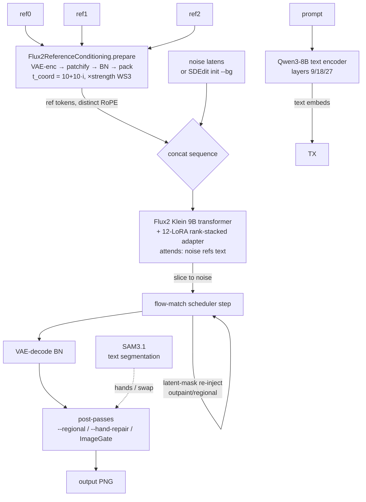

# flux2 multi-reference architecture (`flux2 scene`)

How the **multi-reference conditioning** path works in the Swift/MLX `flux2`
CLI (the `scene` / `style` / `swap` commands). Covers the models, LoRAs, and
techniques involved, **how many reference images it can take**, the per-image
conditioning pipeline, end-to-end architecture diagrams, and the architectural
limitations discovered by testing. (For per-command CLI usage see the main
`README.md`; this doc is the internals/knowledge reference.)

> Ported from the ComfyUI "Klein 完全体 三參考圖全能王" workflow. The reference
> conditioning math (`Flux2ReferenceConditioning.prepare`) mirrors mflux's
> `flux2_klein_edit_helpers.prepare_reference_image_conditioning`.

---

## 1. How many reference images can it use?

**No hard cap in the code** — `--ref` is repeatable and `prepare()` loops over
every image with no limit. Each reference gets a distinct RoPE coordinate
(`t_coord = 10 + 10·i`), so the transformer can tell them apart for any N.
The **practical ceiling is VRAM + quadratic attention**, not a count limit.

### Reference-image budgets (researched 2026-06)

| surface | max ref images | note |
|---|---|---|
| **this Swift/MLX port** | **no hard cap** (like ComfyUI local) | limited by unified-memory + O(seq²) attention |
| BFL API (Klein endpoint) | 4–8 | per-endpoint |
| BFL Playground (web UI) | 10 | |
| Together AI FLUX.2 Pro | 10 (14 MP total) | megapixel budget dominates |
| ComfyUI (local, community) | ~5–6 typical | OOM before any count limit |

### Token budget per reference (why VRAM is the limit)

Each ref is patchified to `(H/16)·(W/16)` sequence tokens. For a 1024² scene
the noise is 4096 tokens; **each reference adds roughly another 4096 tokens**
to the sequence, and transformer self-attention is **O(seq²)**:

| ref image size | tokens added to the sequence |
|---|---|
| 640×960 (portrait) | 2,400 |
| 768×1024 (full-body) | 3,072 |
| 1024×1024 (square) | 4,096 |

So at 1024²: 0 refs ≈ 4,600 tokens (noise+text), 1 ref ≈ 8,700, 2 refs ≈ 12,800,
3 refs ≈ 16,900 … each ref ≈ +47 % sequence length and ≈ +~110 % attention cost
relative to the no-ref baseline. **3 distinct refs (2 characters + 1 `--bg`
canvas) is the comfort zone; 4–5 is feasible; beyond that needs lower ref
resolution or tiled/sequential conditioning.**

> Tip: refs are internally resized to the scene resolution (`loadArray(
> targetSize:)`), so a small ref file still costs full-res tokens. To cheapen
> conditioning, downscale the scene or use fewer/lower-res refs.

---

## 2. The reference-conditioning pipeline (per image)

```
 ref image ─► load + resize to scene W×H
            ─► normalize to [-1,1]
            ─► VAE-encode            → (1, 32, H/8, W/8)
            ─► crop_to_even_spatial
            ─► patchify (32→128ch, 2× down)  → (1, 128, H/16, W/16)
            ─► BatchNorm-normalize (encode dir: (x-mean)/std)
            ─► pack to sequence tokens       → (1, (H/16)(W/16), 128)
            ─► × per-ref strength (WS3)
            ─► RoPE grid ids, t_coord = 10 + 10·i   ← distinguishes each ref
```

All ref token blocks are **concatenated along the sequence axis** to the noisy
latents, then the transformer attends over `[noise | ref0 | ref1 | … | text]`
jointly. The output is sliced back to keep only the noise tokens (ref-token
outputs are discarded). Text is encoded separately and attends as
`encoder_hidden_states`.

---

## 3. Architecture diagram

### 3a. `flux2 scene` end-to-end (the multi-ref path)

```
                         ┌──────────────────────────────────────────────┐
   prompt ──────────────►│  Qwen3-8B text encoder  ──► prompt embeds    │
                         │  (layers 9/18/27, maxLen 512)                 │
                         └──────────────────────────────────────────────┘
                                    │  (encoder_hidden_states)
   ┌── ref0 ─┐                      ▼
   │  ref1   │──► Flux2ReferenceConditioning.prepare ──► ref tokens
   │  ref2   │      (VAE-enc → patchify → BN → pack)      (concatenated,
   └─────────┘      t_coord = 10+10·i,  ×strength WS3)     distinct RoPE)
                                    │
   noise latents ───────────────────┤
   (or SDEdit init if --bg)         ▼
                       ┌─────────────────────────────────────────────┐
                       │   Flux2 Klein 9B transformer (+ LoRA stack)  │
                       │   attends over  [ noise | refs | text ]      │
                       │   WS3 gate: refs injected only t < gateStep  │
                       └─────────────────────────────────────────────┘
                                    │  (noise tokens only)
                          scheduler step (flow-match)
                                    │
                  ┌── latent-mask re-injection (outpaint/regional) ──┐
                  ▼                                                 │
            VAE-decode (BN)  ───────────────────────────────────────┘
                                    │
                        pixels  ───► post-passes (optional):
                                    │  · --regional  (strip SDEdit inpaint)
                                    │  · --hand-repair (SAM3 "hands" + inpaint)
                                    │  · ImageGate self-check
                                    ▼
                                  output PNG
```

### 3b. Mermaid (renders on GitHub)



---

## 4. Models, LoRAs, and techniques used

| component | what | where |
|---|---|---|
| **transformer** | Flux2 Klein 9B (`klein-9b`) | `Flux2Transformer` |
| **text encoder** | Qwen3-8B (`qwen3-8b`, layers 9/18/27) | `Flux2TextEncoder` |
| **tokenizer** | `qwen3-klein` | `Flux2Tokenizer` |
| **VAE** | Flux2 Klein VAE + BatchNorm stats (encode/decode share BN mean/var) | `Flux2VAEEncoder/Decoder` + `Flux2BatchNormStats` |
| **reference conditioning** | VAE-enc → patchify (32→128ch) → BN-norm → pack tokens; per-ref RoPE `t_coord`; per-ref strength (WS3) | `Flux2ReferenceConditioning` |
| **LoRA stack** | up to 12 Flux2 Klein LoRAs, rank-stacked into ONE adapter (`A=hstack(√s·Aᵢ)`, `B=vstack(√s·Bᵢ)`) | `Flux2LoRALoader.merge` |
| **LoRA key formats** | BFL native / WebUI-ComfyUI / diffusers — all load (WebUI remapped at int8 time) | `convert_lora_mlx.py` + `Flux2LoRALoader.load` |
| **SDEdit / background canvas** | `--bg` image → VAE-init latent, partial denoise (flow-mix `(1-σ)·init + σ·noise`) | `Flux2EditPipeline.generate(initLatent/denoiseStrength)` |
| **outpaint / regional / hand-repair** | latent-mask re-injection each step + feathered pixel composite; regional uses SDEdit partial denoise to spare hands | `Flux2Outpaint`, `inpaint(denoiseStrength:)` |
| **segmentation** | SAM3.1 text-prompted (mlx-vlm bridge) — used by swap, regional, hand-repair | `sam3_segment_bridge.py` |
| **super-resolution** | RealPLKSR 4× (native Swift/MLX, channels-last NHWC; tiled for large inputs) | `ESRGAN` |
| **multi-seed auto-select** | sweep N seeds → local-LLM verify (placement + hands) → keep best | `scripts/multi-seed-autoselect.sh` |
| **self-gating** | `ImageGate` noise/blank/NaN check on every output | `CommonImageDirector` |

### The 12-LoRA "卡通转真人工场" stack
`anything2real-a`, `anything2real-characters`, `chest-9b`, `skin-tone`,
`lips-9b`, `eye-9b`, `details-9b`, `longface-9b`, `colorful`, `qualitya`,
`darkklein-v2bfs-r256`, `nexblend-asian`. All int8-quantized, binary
externalized to `../video_generation__models/<md5>.safetensors`. See the main
`README.md` table for per-LoRA scale + source.

---

## 5. Known limitations (tested 2026-06, local-LLM verified)

These are **architectural**, not bugs:

1. **Refs are GLOBAL — no identity→position binding.** Ref tokens are
   concatenated globally and attended to by every noise patch equally. Their
   RoPE coordinate is a *time* coordinate (`t_coord`), **not spatial** — there
   is no "ref1 → left half" routing. So **placement is 100 % prompt-driven**:
   reliable but probabilistic (a clear prompt + distinct visual cues lands
   correctly across most seeds, but not guaranteed). Verified: 5/5 seeds placed
   a 2-person scene correctly via prompt alone.

2. **`--regional` is a best-effort mitigation, not a fix.** It refines each ref
   into a vertical strip via SDEdit inpaint (`--regional-strength`, default
   0.45). At full regen (1.0) it was net-negative (ghosting + fused fingers);
   the SDEdit path nudges identity without re-rolling hands. True region-bound
   identity needs **IP-Adapter Regional** (mask→ref binding) — a separate
   conditioning architecture not ported to Swift/MLX.

3. **Hands are the platform ceiling.** Fused/extra fingers are a Flux2-Klein
   platform artifact (artifacts score 3–5 flat across all `scene` runs).
   `--hand-repair` (SAM3-segment hands → re-denoise) is a best-effort scene-side
   mitigation; the underlying artifact is not fixable from `scene`.

4. **Skin plastickness** is the same platform artifact seen on both z-image and
   flux2-klein bases — not a LoRA effect, no generation-side lever fixes it.

**Recommended workflow:** for multi-person scenes, prefer **multi-seed
auto-select** (`scripts/multi-seed-autoselect.sh`) over `--regional`. Use
`--regional --regional-strength 0.45` only when prompt placement actually fails.
Add `--hand-repair` when hands matter.

---

## Sources (reference-image budgets)

- [r/StableDiffusion — Flux2 Klein max 5 reference images?](https://www.reddit.com/r/StableDiffusion/comments/1qg9tln/flux2_klein_max_limit_5_reference_images_only/)
- [r/comfyui — adding multiple reference images with Klein2 KV](https://www.reddit.com/r/comfyui/comments/1t1mu4h/adding_multiple_reference_images_into_a_single/)
- [Together AI FLUX.2 Pro specs (up to 10 images, 14 MP)](https://www.together.ai/)
- BFL official docs (Playground up to 10 reference images, 4 MP output)
